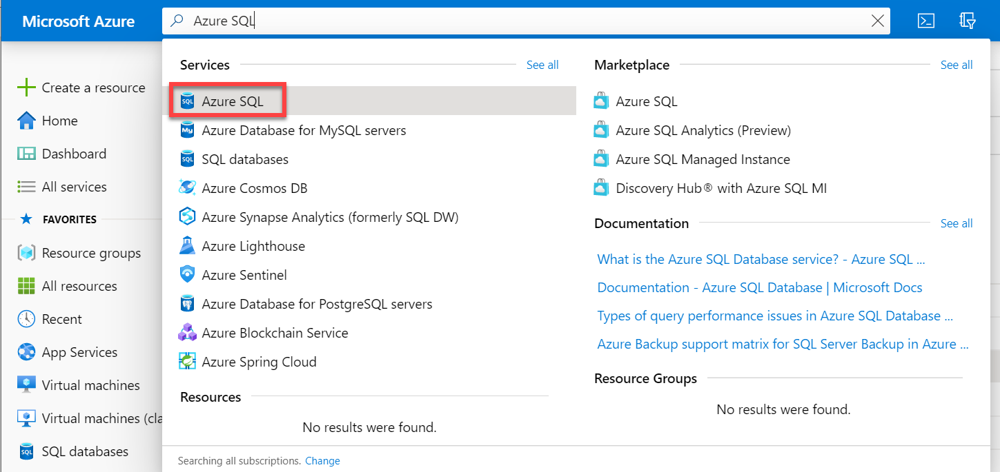
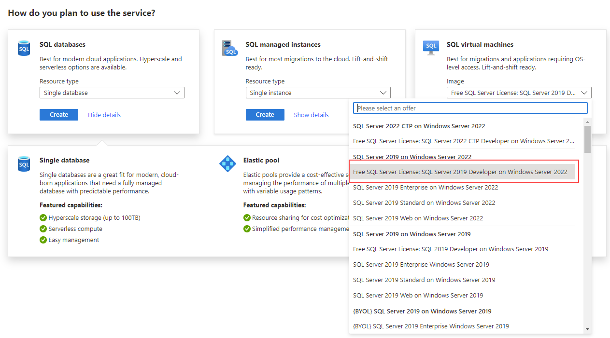
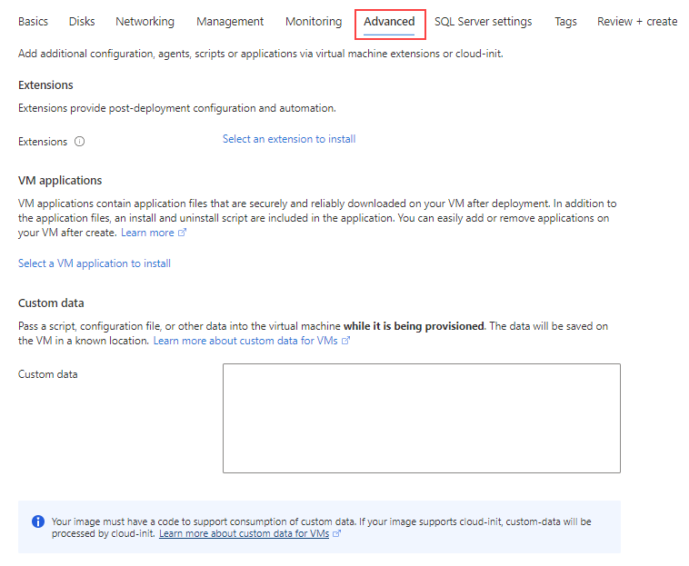
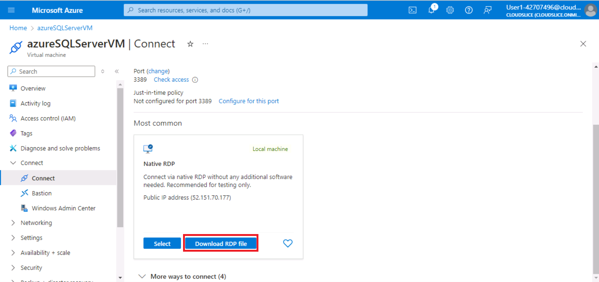
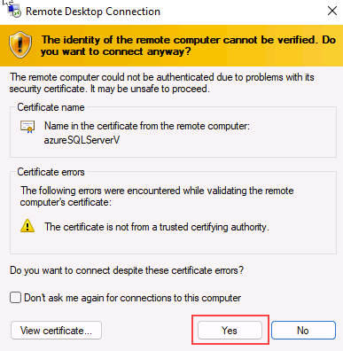

---
lab:
  title: 'ラボ 1: Azure 仮想マシンで SQL Server をプロビジョニングする'
  module: Plan and Implement Data Platform Resources
---

# Azure 仮想マシンで SQL Server をプロビジョニングする

**推定所要時間:30 分**

受講生は Azure portal を探索し、それを使用して SQL Server 2019 がインストールされた Azure VM を作成します。 次に、それらをリモート デスクトップ プロトコルを使用して仮想マシンに接続します。

あなたは、AdventureWorks のデータベース管理者です。 あなたは、概念実証で使用するためのテスト環境を作成する必要があります。 概念実証では、Azure Virtual Machine で SQL Server を使用し、AdventureWorksDW データベースのバックアップを使用します。 仮想マシンをセットアップし、データベースを復元し、クエリを実行して、使用可能であることを確認する必要があります。

## Azure 仮想マシンで SQL Server をデプロイする

1. ラボの仮想マシンからブラウザー セッションを開始して [https://portal.azure.com](https://portal.azure.com/) に移動し、お使いの Azure サブスクリプションに関連付けられている Microsoft アカウントを使用してサインインします。

    

1. ページの上部にある検索バーを見つけます。 **Azure SQL** を検索します。 **[サービス]** の下の結果に表示される **Azure SQL** の検索結果を選択します。

    

1. **[Azure SQL]** ウィンドウで、 **[作成]** を選択します。

    

1. **[SQL デプロイ オプションを選択する]** ウィンドウで、 **[SQL 仮想マシン]** の下のドロップダウン ボックスをクリックします。 **[Free SQL Server License: SQL 2019 Developer on Windows Server 2022]** というラベルの付いたオプションを選択します。 **[作成]** を選択します。

    

1. **[仮想マシンの作成]** ページで、次の情報を入力します。

    - **サブスクリプション** &lt;お使いのサブスクリプション&gt;
    - **リソース グループ:** &lt;お使いのリソース グループ&gt;
    - **仮想マシン名:** azureSQLServerVM
    - **リージョン:** &lt;リソース グループ用に選択されたリージョンと同じローカル リージョン&gt;
    - **可用性オプション:** インフラストラクチャ冗長は必要ありません
    - **イメージ:** 無料の SQL Server ライセンス: Windows Server 2022 上の SQL 2019 Developer - Gen1
    - **Azure スポット インスタンス:** なし (オフ)
    - **サイズ:** Standard *D2s_v3* (2 vCPU、8 GiB メモリ)。 このオプションを表示するには [すべてのサイズを表示] リンクを選択することが必要な場合があります。
    - **Administrator アカウントのユーザー名:** sqladmin
    - **管理者アカウントのパスワード:** pwd!DP300lab01 (または基準を満たす独自のパスワード)
    - **受信ポートを選択:** RDP (3389)
    - **既存の Windows サーバー ライセンスを使用しますか?:** いいえ (オフ)

    ユーザー名とパスワードは後で使うためにメモしておきます。

    

1. **[ディスク]** タブに移動し、構成を確認します。

    

1. **[ネットワーク]** タブに移動し、構成を確認します。

    

1. **[管理]** タブに移動し、構成を確認します。

    

    **[自動シャットダウンを有効にする]** がオフになっていることを確認します。

1. **[詳細]** タブに移動し、構成を確認します。

    

1. **[SQL Server の設定]** タブに移動し、構成を確認します。

    

    **注 -** この画面では、SQL Server VM のストレージを構成することもできます。 既定では、SQL Server Azure VM テンプレートは、データの読み取りキャッシュ付きのプレミアム ディスクを1つ、トランザクションログのキャッシュなしのプレミアム ディスクを1つ作成し、tempdb にローカル SSD（Windows では D:\）を使用します。

1. **[確認および作成]** ボタンを選択します。 **[作成]** を選択します。

    

1. デプロイ ブレードで、デプロイが完了するまで待ちます。 VM のデプロイには約 5 - 10 分かかります。 デプロイが完了したら、 **[リソースに移動]** を選択します。

    **注:** デプロイが完了するまでに数分かかる場合があります。

    

1. 仮想マシンの **[概要]** ページで、このリソースのメニュー オプションを調べて、使用可能なオプションを確認します。

    

## Azure 仮想マシンで SQL Server に接続する

1. 仮想マシンの **[概要]** ページで **[接続]** を選択します。

1. [接続] ウィンドウで、**[RDP ファイルのダウンロード]** を選択します。

    

    **注:** エラー "**ポートの前提条件が満たされていません**" が表示された場合。 リンクを選択して、"ポート番号" フィールドに記載されている宛先ポートを含む受信ネットワーク セキュリティ グループ ルールを追加します。**

    

1. ダウンロードした RDP ファイルを開きます。 接続するかどうかを尋ねるダイアログが表示されたら、 **[接続]** を選択します。

    

1. 仮想マシンのプロビジョニング プロセス中に選択したユーザー名とパスワードを入力します。 **[OK]** をクリックします。

    

1. 接続するかどうかを尋ねる **[リモート デスクトップ接続]** ダイアログが表示されたら、 **[はい]** を選択します。

    

1. Windows の [スタート] ボタンを選択し、SSMS と入力します。 一覧から **[Microsoft SQL Server Management Studio]** を選びます。  

1. SSMS が開くと、 **[サーバーに接続]** ダイアログに既定のインスタンス名が事前に入力されていることがわかります。 **[サーバー証明書を信頼する]** オプションをオンにし、**[接続]** を選択します。

    

Azure portal には、仮想マシンでホストされている SQL Server を管理するための強力なツールが用意されています。 これらのツールには、修正プログラムの自動適用の制御、自動バックアップ、高可用性を簡単に設定する方法が含まれています。
