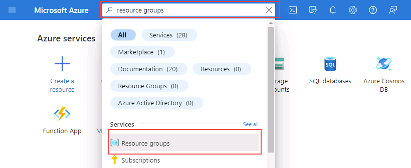
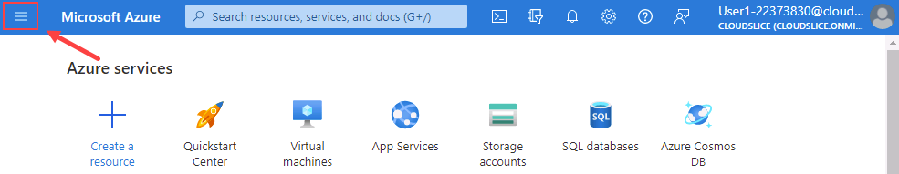
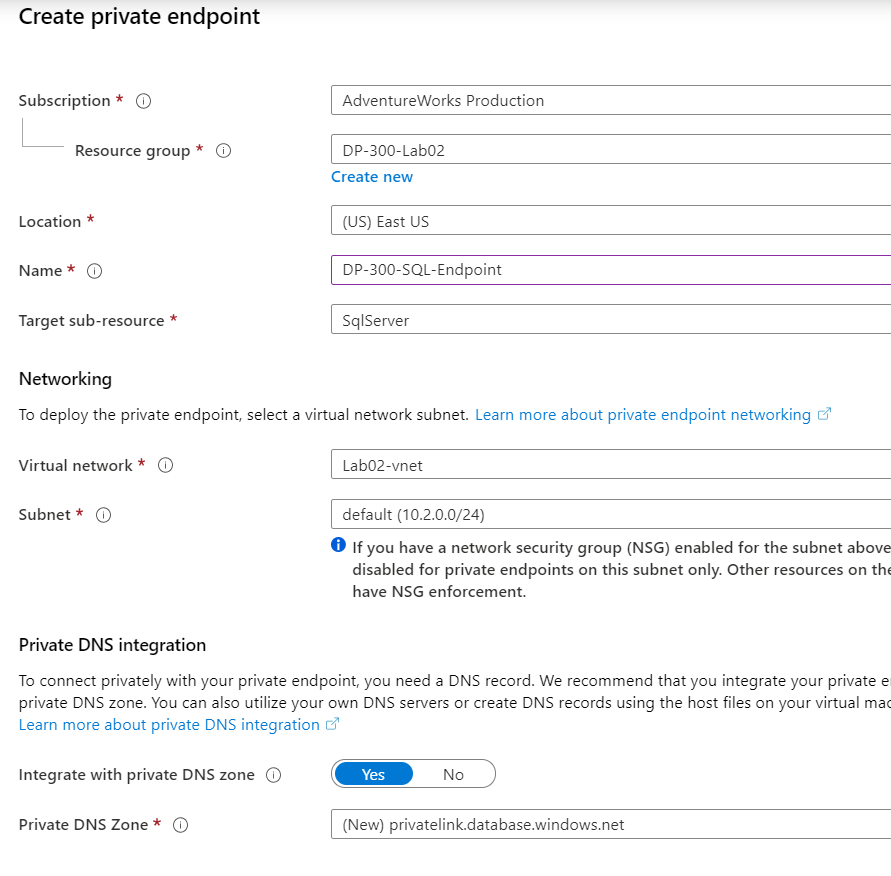
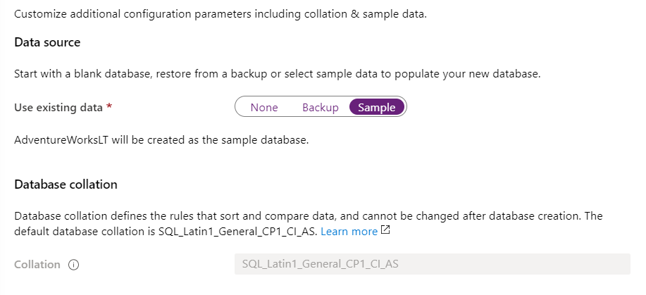
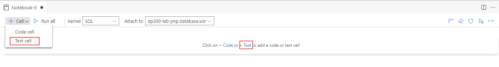
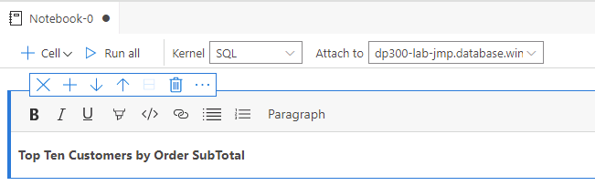

---
lab:
  title: ラボ 2 -Azure SQL Database をプロビジョニングする
  module: Plan and Implement Data Platform Resources
---

# Azure SQL Database をプロビジョニングする

**推定所要時間: 40 分**

受講者は、Virtual Network エンドポイントを使用して Azure SQL Database をデプロイするために必要な基本のリソースを構成します。 SQL Database への接続は、ラボの VM から Azure Data Studio を使用して検証されます。

AdventureWorks のデータベース管理者は、Virtual Network エンドポイントを含む新しい SQL データベースをセットアップして、デプロイのセキュリティを強化および簡略化します。 Azure Data Studio を使用して、データ クエリと結果保持のための SQL Notebook の使用を評価します。

## Azure portal に移動する

1. ラボの仮想マシンからブラウザー セッションを開始し、[https://portal.azure.com](https://portal.azure.com/) に移動します。 このラボ仮想マシンの **[リソース]** タブで提供されている Azure の **[ユーザー名]** と **[パスワード]** を使用してポータルに接続します。

    

1. Azure portal の上部にある検索ボックスで "リソース グループ" を検索し、オプションの一覧から**リソース グループ**を選択します。

    

1. **[リソース グループ]** ページで、一覧表示されているリソース グループ (*contoso-rg* で始まるはずである) を確認し、次の演習で使用するため、リソース グループに割り当てられている**場所**を書き留めます。

    **メモ:** 別の場所が割り当てられている場合があります。

    

## 仮想ネットワークを作成します

1. Azure portal ホーム ページで、左側のメニューを選択します。  

    

1. 左側のナビゲーション ペインで、 **[仮想ネットワーク]** をクリックします  

1. **[+ 作成]** をクリックして **[仮想ネットワークの作成]** ページを開きます。 **[基本]** タブで次の情報を入力します。

    - **サブスクリプション:** &lt;自分のサブスクリプション&gt;
    - **リソース グループ:** *contoso-rg* で始まる
    - **名前:** lab02-vnet
    - **リージョン:** リソース グループが作成されたのと同じリージョンを選択する

1. **[確認と作成]** をクリックし、新しい仮想ネットワークの設定を確認して、 **[作成]** をクリックします。

## Azure SQL Database をプロビジョニングする

1. Azure portal の上部にある検索ボックスで “SQL データベース” を検索し、オプションの一覧から **SQL データベース**をクリックします。

    

1. **[SQL データベース]** ブレードで、 **[+ 作成]** を選択します。

    

1. **[SQL データベースの作成]** ページの **[Basics]** タブで次のオプションを選択し、 **[次へ: ネットワーク]** をクリックします。

    - **サブスクリプション:** &lt;自分のサブスクリプション&gt;
    - **リソース グループ:** *contoso-rg* で始まる
    - **データベース名:** AdventureWorksLT
    - **サーバー:** **[新規作成]** リンクをクリックします。 **[SQL Database サーバーの作成]** ページが表示されます。 サーバーの詳細を次のように指定します。
        - **サーバー名:** dp300-lab-&lt;自分のイニシャル (小文字)&gt; (サーバー名はグローバルに一意である必要がある)
        - **リージョン:** &lt;リソース グループ用に選択したリージョンと同じローカル リージョン (それ以外は、失敗する可能性がある)&gt;
        - **認証方法:** SQL 認証を使用する
        - **サーバー管理者のログイン:** dp300admin
        - **パスワード:** dp300P@ssword!
        - **パスワードの確認:** dp300P@ssword!

        **[SQL Database サーバーの作成]** ページは、次のようになります。 次に、 **[OK]** をクリックします

        

    -  **[SQL データベースの作成]** ページに戻り、 **[エラスティック プールを使用しますか?]** が **[いいえ]** に設定されていることを確認します。
    -  **[コンピューティングとストレージ]** オプションで、 **[データベースの構成]** リンクをクリックします。 **[構成]** ページの **[サービス レベル]** ドロップダウンで、 **[基本]** 、 **[適用]** の順に選択します。

    **メモ:** このサーバー名と自分のログイン情報を書き留めます。 このラボの後半で使用します。

1. **[バックアップ ストレージの冗長性]** オプションについては、既定値の **[geo 冗長バックアップ ストレージ]** のままにします。

1. **[次へ: ネットワーク]** をクリックします。

1. **[ネットワーク]** タブ の **[ネットワーク接続]** オプションで、 **[プライベート エンドポイント]** ラジオ ボタンをクリックします。

    

1. 次に、 **[プライベート エンドポイント]** オプションの下の **[+ プライベート エンドポイントの追加]** リンクをクリックします。

    

1. 右側ペインの **[プライベート エンドポイントの作成]** を次のように設定します。

    - **サブスクリプション:** &lt;自分のサブスクリプション&gt;
    - **リソース グループ:** *contoso-rg* で始まる
    - **リージョン:** &lt;リソース グループ用に選択したリージョンと同じローカル リージョン (それ以外は、失敗する可能性がある)&gt;
    - **名前:** DP-300-SQL-Endpoint
    - **ターゲット サブリソース:** SqlServer
    - **仮想ネットワーク:** lab02-vnet
    - **サブネット:** lab02-vnet/default (10.x.0.0/24)
    - **プライベート DNS ゾーンと統合する:** はい
    - **プライベート DNS ゾーン:** 既定値のままにする
    - 設定を確認し、 **[OK]** をクリックします  

    

1. 新しいエンドポイントが **[プライベート エンドポイント]** の一覧に表示されます。

    

1. **[次へ: セキュリティ]** 、 **[次へ: 追加設定]** の順にクリックします。  

1. **[追加設定]** ページで、 **[既存のデータを使用]** オプションの **[サンプル]** を選択します。 サンプル データベースのポップアップ メッセージが表示される場合は、 **[OK]** を選択します。

    

1. **[Review + Create](レビュー + 作成)** をクリックします。

1. 設定を確認してから、 **[作成]** をクリックします。

1. デプロイが完了したら、 **[リソースに移動]** をクリックします。

## Azure SQL Database へのアクセスを有効にする

1. **[SQL データベース]** ページで **[概要]** セクションを選択し、上部セクション内のサーバー名のリンクを選択します。

    

1. [SQL サーバー] ナビゲーション ブレードで、 **[セキュリティ]** セクションの **[ネットワーク]** を選択します。

    

1. **[パブリック アクセス]** タブで **[選択したネットワーク]** を選択し、 **[Azure サービスおよびリソースにこのサーバーへのアクセスを許可する]** プロパティをオンにします。 **[保存]** をクリックします。

    

## Azure Data Studio で Azure SQL Database に接続する

1. ラボ仮想マシンから Azure Data Studio を起動します。

    - Azure Data Studio の初回起動時にこのポップアップが表示される場合があります。 表示されたら、 **[はい (推奨)]** をクリックします  

        

1. Azure Data Studio が開いたら、左上隅にある **[接続]** ボタンをクリックし、 **[接続の追加]** をクリックします。

    

1. **[接続]** サイドバーの **[接続の詳細]** セクションに、前もって作成した SQL データベースに接続するための接続情報を入力します。

    - 接続の種類: **Microsoft SQL Server**
    - サーバー: 前もって作成した SQL Server の名前を入力します。 例: **dp300-lab-xxxxxxxx.database.windows.net** ('xxxxxxxx' はランダムな番号)
    - 認証の種類: **SQL ログイン**
    - ユーザー名: **dp300admin**
    - パスワード: **dp300P@ssword!**
    - [データベース] ドロップダウンを展開して **AdventureWorksLT** を選択します。 
        - **注:** クライアント IP がこのサーバーにアクセスできるようにするためにファイアウォール規則を追加するよう求められることがあります。 ファイアウォール規則を追加するように求められた場合は、 **[アカウントの追加]** をクリックして、Azure アカウントにログインします。 **[新しいファイアウォール規則を作成する]** 画面で、 **[OK]** をクリックします。

        

        または、SQL サーバーに移動して **[ネットワーク]** を選択し、 **[+ クライアント IPv4 アドレス (自分の IP アドレス) を追加する]** を選択して、Azure portal で SQL サーバーのファイアウォール規則を手動で作成することもできます

        

    接続　サイドバーに戻り、接続の詳細を入力し続けます。  

    - [サーバー グループ] は **&lt;Default&gt;** のままです
    - [名前 (省略可能)] では、必要に応じてデータベースのフレンドリ名を指定できます
    - 設定を確認し、 **[接続]** をクリックします  

    

1. Azure Data Studio からデータベースに接続すると、データベースに関するいくつかの基本情報と、オブジェクトの部分的なリストが表示されます。

    

## SQL ノートブックを使用して Azure SQL Database へのクエリを実行する

1. このラボの AdventureWorksLT データベースに接続されている Azure Data Studio で、 **[新しいノートブック]** ボタンをクリックします。

    

1. **[+テキスト]** リンクをクリックして、ノートブックに新しいテキスト ボックスを追加します  

    

**注:**  ノートブック内には、クエリまたは結果セットについて説明するプレーンテキストを埋め込むことができます。

1. テキスト「**注文小計別上位 10 位の顧客**」と入力し、必要に応じて太字にします。

    

1. **[+ セル]** ボタン、 **[コード セル]** の順にクリックして、ノートブックの最後に新しいコード セルを追加します。  

    

5. 次の SQL ステートメントを新しいセルに貼り付けます。

```sql
SELECT TOP 10 cust.[CustomerID], 
    cust.[CompanyName], 
    SUM(sohead.[SubTotal]) as OverallOrderSubTotal
FROM [SalesLT].[Customer] cust
    INNER JOIN [SalesLT].[SalesOrderHeader] sohead
         ON sohead.[CustomerID] = cust.[CustomerID]
GROUP BY cust.[CustomerID], cust.[CompanyName]
ORDER BY [OverallOrderSubTotal] DESC
   ```

1. 矢印の付いた青い円をクリックして、クエリを実行します。 クエリによる結果がセル内にどのように含まれるかに注目してください。

1. **[+ テキスト]** ボタンをクリックして、新しいテキスト セルを追加します。

1. テキスト「**上位 10 位の注文製品カテゴリ**」と入力し、必要に応じて太字にします。

1. **[+ コード]** ボタンをもう一度クリックして新しいセルを追加し、次の SQL ステートメントをセルに貼り付けます。

```sql
SELECT TOP 10 cat.[Name] AS ProductCategory, 
    SUM(detail.[OrderQty]) AS OrderedQuantity
FROM salesLT.[ProductCategory] cat
   INNER JOIN [SalesLT].[Product] prod
      ON prod.[ProductCategoryID] = cat.[ProductCategoryID]
   INNER JOIN [SalesLT].[SalesOrderDetail] detail
      ON detail.[ProductID] = prod.[ProductID]
GROUP BY cat.[name]
ORDER BY [OrderedQuantity] DESC
```

1. 矢印の付いた青い円をクリックして、クエリを実行します。

1. ノートブック内のすべてのセルを実行して結果を表示するには、ツールバーの **[すべて実行]** ボタンをクリックします。

    

1. Azure Data Studio 内で、ノートブックを [ファイル] メニュー ([保存] または [名前を付けて保存] ) から **C:\Labfiles\Deploy Azure SQL Database** パスに保存します (存在しない場合はフォルダー構造を作成します)。 ファイル拡張子が **.ipynb** であることを確認します

1. Azure Data Studio 内からノートブックのタブを閉じます。 [ファイル] メニューから [ファイルを開く] を選択し、保存したノートブックを開きます。 クエリの結果がクエリと共にノートブックに保存されていることを確かめます。

この演習では、Virtual Network エンドポイントを使用して Azure SQL Database をデプロイする方法について説明しました。 また、SQL Server Management Studio を使用して作成した SQL Database に接続することもできました。
