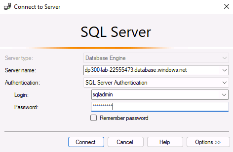
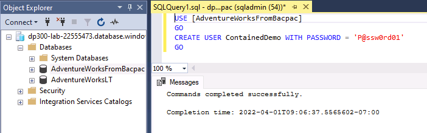
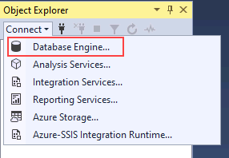
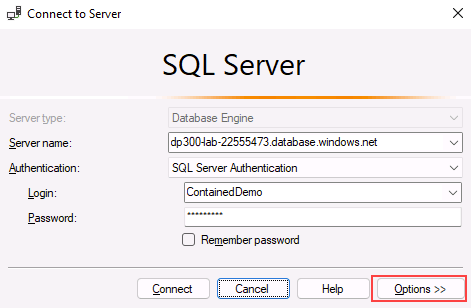

---
lab:
  title: ラボ 4 – Azure SQL Database ファイアウォール規則を構成する
  module: Implement a Secure Environment for a Database Service
---

# <a name="implement-a-secure-environment"></a>安全な環境を実装する

**推定所要時間:30 分**

学生は、レッスンで得た情報を利用して、Azure portal と AdventureWorks データベース内でセキュリティを構成して実装します。

あなたは、データベース環境のセキュリティを確保するために、上級データベース管理者として採用されています。 これらのタスクは Azure SQL Database に焦点を当てます。

**注:** これらの演習では、T-SQL コードをコピーして貼り付けるように求められます。 コードを実行する前に、コードを正しくコピーしていることを確認してください。

## <a name="configure-azure-sql-database-firewall-rules"></a>Azure SQL Database ファイアウォール規則を構成する

1. ラボの仮想マシンからブラウザー セッションを開始し、[https://portal.azure.com](https://portal.azure.com/) に移動します。 このラボ仮想マシンの **[リソース]** タブで提供されている Azure の **[ユーザー名]** と **[パスワード]** を使用してポータルに接続します。

    

1. Azure portal の上部にある検索ボックスで "SQL サーバー" を検索し、オプションの一覧から **[SQL サーバー]** をクリックします。

    

1. サーバー名 **dp300-lab-XXXXXXXX** を選択すると、詳細ページが表示されます (SQL サーバーに別のリソース グループと場所が割り当てられている場合があります)。

    

1. SQL サーバーの [詳細画面] で、マウスをサーバー名の右に移動してから、以下に示すように **[クリップボードにコピー]** ボタンをクリックします。

    

1. **[ネットワーク設定を表示する]** を選択します。

    

1. **[ネットワーク]** ページで、 **[+ クライアント IPv4 アドレス (IP アドレス) の追加]** をクリックし、 **[保存]** をクリックします。

    

    **注:** クライアント IP アドレスは自動的に入力されました。 使用するクライアント IP アドレスを一覧に追加すると、SQL Server Management Studio またはその他任意のクライアント ツールを使用して、Azure SQL Database に接続できます。 **クライアントの IP アドレスをメモしてください。後で使用します。**

1. SQL Server Management Studio を開きます。 [サーバーへの接続] ダイアログ ボックスで、Azure SQL Database サーバーの名前を貼り付け、次の資格情報でログインします。

    - **サーバー名:** &lt;Azure SQL Database のサーバー名をここに貼り付けてください&gt;__
    - **認証:** SQL Server 認証
    - **サーバー管理者ログイン:** sqladmin
    - **パスワード:** P@ssw0rd01

    

1. **[Connect]** をクリックします。

1. オブジェクト エクスプローラーでサーバー ノードを展開し、 **[Database]** を右クリックします。 **[データ層アプリケーションのインポート]** をクリックします。

    

1. **[データ層アプリケーションのインポート]** ダイアログで、最初の画面の **[次へ]** をクリックします。

1. **https://github.com/MicrosoftLearning/dp-300-database-administrator/blob/master/Instructions/Templates/AdventureWorksLT.bacpac** にある .bacpac ファイルをラボ VM の **C:\LabFiles\Secure Environment** パスにダウンロードします (フォルダー構造が存在しない場合は作成します)。

1. **[インポートの設定]** 画面で、 **[参照]** をクリックし、**C:\LabFiles\Secure Environment** フォルダーに移動して **AdventureWorksLT.bacpac** ファイルをクリックし、 **[開く]** をクリックします。 **[データ層アプリケーションのインポート]** 画面に戻り、 **[次へ]** をクリックします。

    

    

1. **[データベースの設定]** 画面で、次のように変更します。

    - **データベース名:** AdventureWorksFromBacpac
    - **Microsoft Azure SQL Database のエディション**: Basic

    

1. **[次へ]** をクリックします。

1. **[概要]** 画面で **[完了]** をクリックします。 インポートが完了すると、次の結果が表示されます。 次に、**[閉じる]** をクリックします。

    

1. SQL Server Management Studio に戻り、**オブジェクト エクスプローラー**で **[Database]** フォルダーを展開します。 次に、**AdventureWorksFromBacpac** データベースを右クリックし、 **[新しいクエリ]** をクリックします。

    

1. テキストをクエリウィンドウに貼り付けて、次の T-SQL クエリを実行します。
    1. **重要:** **000.000.000.00** は実際のクライアント IP アドレスに置き換えます。 **[実行]** をクリックするか、**F5** キーを押してください。

    ```sql
    EXECUTE sp_set_database_firewall_rule 
            @name = N'AWFirewallRule',
            @start_ip_address = '000.000.000.00', 
            @end_ip_address = '000.000.000.00'
    ```

1. 次に、**AdventureWorksFromBacpac** データベースに含まれるユーザーを作成します。 **[新しいクエリ]** をクリックして、次の T-SQL を実行します。

    ```sql
    USE [AdventureWorksFromBacpac]
    GO
    CREATE USER ContainedDemo WITH PASSWORD = 'P@ssw0rd01'
    ```

    

    **注:** このコマンドで、**AdventureWorksFromBacpac** データベース内に含まれるユーザーを作成します。 この資格情報は、次の手順でテストします。

1. **オブジェクト エクスプローラー**に移動します。 **[接続]** 、 **[データベース エンジン]** の順にクリックします。

    

1. 前の手順で作成した資格情報を使用して接続を試みます。 次の情報を使用する必要があります。

    - **ログイン:** ContainedDemo
    - **パスワード:** P@ssw0rd01

     **[Connect]** をクリックします。

     次のエラーが表示されます。

    

    **注:** このエラーは、ユーザーが作成された **AdventureWorksFromBacpac** ではなく、接続で "master" データベースにログインしようとしたために生成されます。 **[OK]** をクリックして接続コンテキストを変更し、エラー メッセージを終了して、次に示すように **[サーバーに接続]** ダイアログ ボックスの **[オプション >>]** をクリックします。

    

1. **[接続のプロパティ]** タブで、データベース名「**AdventureWorksFromBacpac**」を入力し、 **[接続]** をクリックします。

    

1. **ContainedDemo** ユーザーを使用して正しく認証できたことに注意してください。 今度は **AdventureWorksFromBacpac** に直接ログインしました。これは、新しく作成されたユーザーがアクセスできる唯一のデータベースです。

    

この演習では、Azure SQL Database でホストされているデータベースにアクセスするために、サーバーとデータベースのファイアウォール規則を構成しました。 また、T-SQL ステートメントを使用して含まれるユーザーを作成し、SQL Server Management Studio を使用してアクセスを確認しました。
