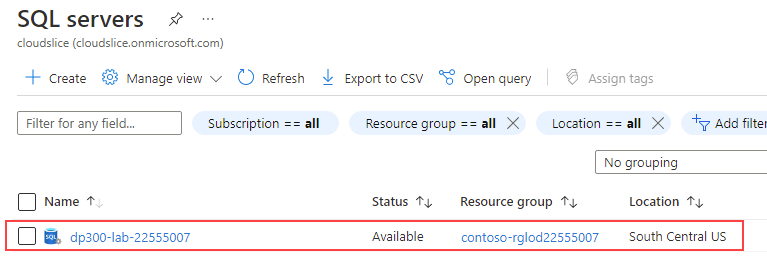
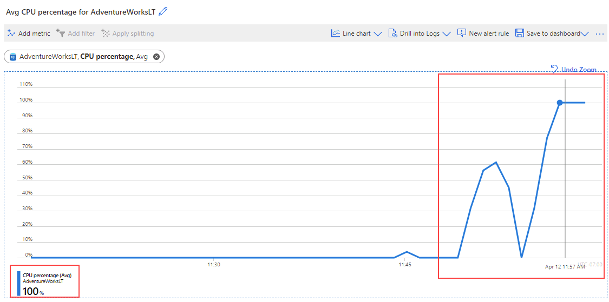
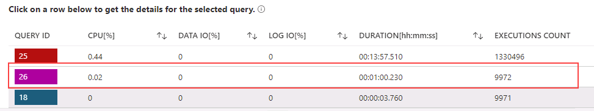

---
lab:
  title: 'ラボ 6: 監視を通じてパフォーマンスの問題を特定する'
  module: Monitor and optimize operational resources in Azure SQL
---

# 監視を通じてパフォーマンスの問題を特定する

**推定所要時間:30 分**

学生は、レッスンで得た情報を利用して、AdventureWorks 内のデジタルトランスフォーメーション プロジェクトの成果物を調べます。 受講者は、Azure portal と他のツールを調べ、ツールを利用してパフォーマンス関連の問題を特定し、解決する方法を決定します。

あなたは、パフォーマンス関連の問題を見つけ出して、見つかった問題を解決するための実用的ソリューションを提供するデータベース管理者として雇用されています。 あなたは Azure portal を使用してパフォーマンスの問題を特定し、それらを解決する方法を提案する必要があります。

**注:**  これらの演習では、T-SQL コードをコピーして貼り付け、既存の SQL リソースを使うように求められます。 コードを実行する前に、コードが正しくコピーされていることを確認してください。

## Azure portal の CPU 使用率を確認する

1. ラボの仮想マシンからブラウザー セッションを開始し、[https://portal.azure.com](https://portal.azure.com/) に移動します。 このラボ仮想マシンの **[リソース]** タブで提供されている Azure の **[ユーザー名]** と **[パスワード]** を使用してポータルに接続します。

    

1. Azure portal の上部にある検索ボックスで “SQL サーバー” を検索し、オプションの一覧から **SQL サーバー**をクリックします。

    

1. サーバー名 **dp300-lab-XXXXXXXX** を選択すると、詳細ページが表示されます (SQL サーバーに別のリソース グループと場所が割り当てられている場合があります)。

    

1. Azure SQL サーバーのメイン ウィンドウで、 **[設定]** セクションに移動し、 **[SQL データベース]** を選択し、データベース名を選択します。

    

1. データベースのメイン ページで、 **[サーバー ファイアウォールの設定]** を選択します。

    ![[サーバー ファイアウォールの設定] の選択を示すスクリーンショット](../images/dp-300-module-06-lab-01.png)

1. **[ネットワーク]** ページで、 **[+ クライアント IPv4 アドレス (お使いの IP アドレス) の追加]** を選択し、 **[保存]** を選択します。

    ![[クライアント IP の追加] の選択を示すスクリーンショット](../images/dp-300-module-06-lab-02.png)

1. **[ネットワーク]** の上のナビゲーションで、**AdventureWorksLT** で始まるリンクを選択します。

    

1. 左側のナビゲーションで、**[クエリ エディター (プレビュー)]** を選択します。

    

    **注:** この機能はプレビュー段階にあります。

1. **[パスワード]** に「 **P@ssw0rd01** 」と入力し、 **[OK]** を選択します。

    

1. **[クエリ 1]** に次のクエリを入力し、 **[実行]** を選択します。

    ```sql
    DECLARE @Counter INT 
    SET @Counter=1
    WHILE ( @Counter <= 10000)
    BEGIN
        SELECT 
             RTRIM(a.Firstname) + ' ' + RTRIM(a.LastName)
            , b.AddressLine1
            , b.AddressLine2
            , RTRIM(b.City) + ', ' + RTRIM(b.StateProvince) + '  ' + RTRIM(b.PostalCode)
            , CountryRegion
            FROM SalesLT.Customer a
            INNER JOIN SalesLT.CustomerAddress c 
                ON a.CustomerID = c.CustomerID
            RIGHT OUTER JOIN SalesLT.Address b
                ON b.AddressID = c.AddressID
        ORDER BY a.LastName ASC
        SET @Counter  = @Counter  + 1
    END
    ```

    

1. クエリが完了するまで待ちます。

1. **AdventureWorksLT** データベースのウィンドウの **[監視]** セクションで、 **[メトリック]** アイコンを選択します。

    ![[メトリック] アイコンの選択を示すスクリーンショット](../images/dp-300-module-06-lab-07.png)

1. **[CPU  percentage]** を反映するように **[メトリック]** メニュー オプションを変更し、 **[平均]** の **[集計]** を選択します。これにより、特定の時間枠の CPU の割合の平均が表示されます。

    ![[CPU の割合] を示すスクリーンショット](../images/dp-300-module-06-lab-08.png)

1. 時間の経過に伴う CPU 平均を観察します。 結果が多少異なる場合があります。 または、クエリを複数回実行して、より多くの統計結果を得ることもできます。

    

## CPU 使用率が高いクエリを特定する

1. **AdventureWorksLT** データベースのウィンドウの **[インテリジェント パフォーマンス]** セクションで **[Query Performance Insight]** アイコンを見つけます。

    ![[Query Performance Insight] アイコンを示すスクリーンショット](../images/dp-300-module-06-lab-10.png)

1. **[設定のリセット]** を選択します。

    ![[設定のリセット] オプションを示すスクリーンショット](../images/dp-300-module-06-lab-11.png)

1. グラフの下のグリッドにあるクエリをクリックします。 クエリが表示されない場合は、2 分ほど待ってから **[最新の情報に更新]** を選択します。

    **注:** 期間とクエリ ID が異なる場合があります。 複数のクエリが表示される場合は、各クエリをクリックして結果を確認します。

    

このクエリの場合、合計期間が 1 分を超えており、約 10,000 回実行されたことがわかります。

この演習では、Azure SQL Database のサーバー リソースを調べ、Query Performance Insight を使用して潜在的なクエリのパフォーマンス問題を特定する方法を学習しました。
