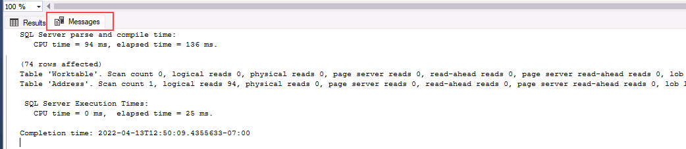

---
lab:
  title: ラボ 7 – 断片化の問題を検出して修正する
  module: Monitor and optimize operational resources in Azure SQL
---

# <a name="detect-and-correct-fragmentation-issues"></a>断片化の問題を検出して修正する

**推定所要時間: 15 分**

学生は、レッスンで得た情報を利用して、AdventureWorks 内のデジタルトランスフォーメーション プロジェクトの成果物を調べます。 受講生は、Azure portal と他のツールを調べ、ネイティブ ツールを利用してパフォーマンス関連の問題を特定して解決する方法を決定します。 最後に、受講者はデータベース内の断片化を特定し、適切に解決する手順を学ぶことができます。

あなたは、パフォーマンス関連の問題を見つけ出して、見つかった問題を解決するための実用的ソリューションを提供するデータベース管理者として雇用されています。 AdventureWorks は、10 年以上にわたって自転車と自転車部品を消費者と販売業者に直接販売しています。 最近、同社は、顧客の依頼対応に使用される製品のパフォーマンスの低下に気づきました。 あなたは SQL ツールを使用してパフォーマンスの問題を特定し、それらを解決する方法を提案する必要があります。

**メモ:** これらの演習で、T-SQL コードをコピーして貼り付けるように求められます。 コードを実行する前に、コードを正しくコピーしていることを確認してください。

## <a name="restore-a-database"></a>データベースを復元する

1. **https://github.com/MicrosoftLearning/dp-300-database-administrator/blob/master/Instructions/Templates/AdventureWorks2017.bak** にあるデータベース バックアップ ファイルをラボ仮想マシンの **C:\LabFiles\Monitor and optimize** パス (存在しない場合は、このフォルダー構造を作成します) にダウンロードします。

    

1. Windows の [スタート] ボタンを選択し、SSMS と入力します。 一覧から **[Microsoft SQL Server Management Studio 18]** を選択します。  

    

1. SSMS が開くと、 **[サーバーに接続]** ダイアログに既定のインスタンス名が事前に入力されていることがわかります。 **[接続]** を選択します。

    

1. **Databases** フォルダーを選択し、 **[新しいクエリ]** を選択します。

    

1. 次の T-SQL をコピーして、新しいクエリ ウィンドウに貼り付けます。 クエリを実行してデータベースを復元します。

    ```sql
    RESTORE DATABASE AdventureWorks2017
    FROM DISK = 'C:\LabFiles\Monitor and optimize\AdventureWorks2017.bak'
    WITH RECOVERY,
          MOVE 'AdventureWorks2017' 
            TO 'C:\LabFiles\Monitor and optimize\AdventureWorks2017.mdf',
          MOVE 'AdventureWorks2017_log'
            TO 'C:\LabFiles\Monitor and optimize\AdventureWorks2017_log.ldf';
    ```

    **注:** データベース バックアップ ファイルの名前とパスは、手順 1 でダウンロードしたものと一致している必要があります。そうでない場合、コマンドは失敗します。

1. 復元が完了すると、成功メッセージが表示されます。

    

## <a name="investigate-index-fragmentation"></a>インデックスの断片化を調査する

1. **[新しいクエリ]** を選択します。 次の T-SQL コードをコピーして、クエリ ウィンドウに貼り付けます。 **[実行]** を選択してこのクエリを実行します。

    ```sql
    USE AdventureWorks2017
    GO
    
    SELECT i.name Index_Name
     , avg_fragmentation_in_percent
     , db_name(database_id)
     , i.object_id
     , i.index_id
     , index_type_desc
    FROM sys.dm_db_index_physical_stats(db_id('AdventureWorks2017'),object_id('person.address'),NULL,NULL,'DETAILED') ps
     INNER JOIN sys.indexes i ON ps.object_id = i.object_id 
     AND ps.index_id = i.index_id
    WHERE avg_fragmentation_in_percent > 50 -- find indexes where fragmentation is greater than 50%
    ```

    このクエリで、断片化が **50%** を超えるインデックスが報告されるようになります。 クエリから、結果が返されないはずです。

1. **[新しいクエリ]** を選択します。 次の T-SQL コードをコピーして、クエリ ウィンドウに貼り付けます。 **[実行]** を選択してこのクエリを実行します。

    ```sql
    USE AdventureWorks2017
    GO
        
    INSERT INTO [Person].[Address]
        ([AddressLine1]
        ,[AddressLine2]
        ,[City]
        ,[StateProvinceID]
        ,[PostalCode]
        ,[SpatialLocation]
        ,[rowguid]
        ,[ModifiedDate])
        
    SELECT AddressLine1,
        AddressLine2, 
        'Amsterdam',
        StateProvinceID, 
        PostalCode, 
        SpatialLocation, 
        newid(), 
        getdate()
    FROM Person.Address;
    
    GO
    ```

    このクエリでは、多数の新しいレコードの追加によって、Person.Address テーブルとそのインデックスの断片化レベルが上昇します。

1. 最初のクエリをもう一度実行します。 4 つの非常に断片化されたインデックスが表示されるようになるはずです。

    

1. 次の T-SQL コードをコピーして、クエリ ウィンドウに貼り付けます。 **[実行]** を選択してこのクエリを実行します。

    ```sql
    SET STATISTICS IO,TIME ON
    GO
        
    USE AdventureWorks2017
    GO
        
    SELECT DISTINCT (StateProvinceID)
        ,count(StateProvinceID) AS CustomerCount
    FROM person.Address
    GROUP BY StateProvinceID
    ORDER BY count(StateProvinceID) DESC;
        
    GO
    ```

    SQL Server Management Studio の結果ペインで、**[メッセージ]** タブをクリックします。 クエリによって実行された論理読み取りの数をメモしておきます。

    

## <a name="rebuild-fragmented-indexes"></a>断片化されたインデックスを再構築する

1. 次の T-SQL コードをコピーして、クエリ ウィンドウに貼り付けます。 **[実行]** を選択してこのクエリを実行します。

    ```sql
    USE AdventureWorks2017
    GO
    
    ALTER INDEX [IX_Address_StateProvinceID] ON [Person].[Address] REBUILD PARTITION = ALL 
    WITH (PAD_INDEX = OFF, 
        STATISTICS_NORECOMPUTE = OFF, 
        SORT_IN_TEMPDB = OFF, 
        IGNORE_DUP_KEY = OFF, 
        ONLINE = OFF, 
        ALLOW_ROW_LOCKS = ON, 
        ALLOW_PAGE_LOCKS = ON)
    ```

1. 次のクエリを実行して、**IX_Address_StateProvinceID** インデックスの断片化が 50% を超えなくなったことを確認します。

    ```sql
    USE AdventureWorks2017
    GO
        
    SELECT DISTINCT i.name Index_Name
        , avg_fragmentation_in_percent
        , db_name(database_id)
        , i.object_id
        , i.index_id
        , index_type_desc
    FROM sys.dm_db_index_physical_stats(db_id('AdventureWorks2017'),object_id('person.address'),NULL,NULL,'DETAILED') ps
        INNER JOIN sys.indexes i ON (ps.object_id = i.object_id AND ps.index_id = i.index_id)
    WHERE i.name = 'IX_Address_StateProvinceID'
    ```

    結果を比較すると、断片化が 81% から 0 に減少したことがわかります。

1. 前のセクションの select ステートメントを再実行します。 Management Studio の**結果**ペインで、**[メッセージ]** タブの論理読み取りをメモしておきます。 インデックスを再構築する前に検出された論理読み取りの数から変化していますか?

    ```sql
    SET STATISTICS IO,TIME ON
    GO
        
    USE AdventureWorks2017
    GO
        
    SELECT DISTINCT (StateProvinceID)
        ,count(StateProvinceID) AS CustomerCount
    FROM person.Address
    GROUP BY StateProvinceID
    ORDER BY count(StateProvinceID) DESC;
        
    GO
    ```

インデックスは再構築されているため、可能な限り効率的になり、論理読み取りは減少しているはずです。 これで、インデックスのメンテナンスがクエリのパフォーマンスに影響を与える可能性があることがわかりました。

この演習では、インデックスを再構築し、論理読み取りを分析してクエリのパフォーマンスを向上させる方法を学習しました。
