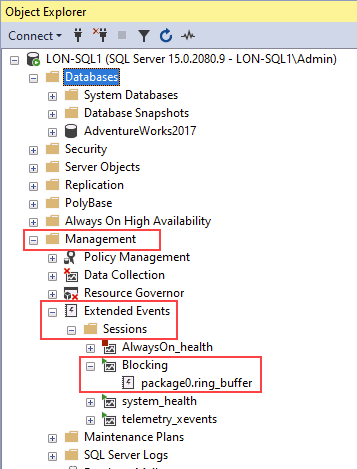

---
lab:
  title: 'ラボ 8: 障害となっている問題を特定して解決する'
  module: Optimize query performance in Azure SQL
---

# 障害となっている問題を特定して解決する

**推定所要時間: 15 分**

学生は、レッスンで得た情報を利用して、AdventureWorks 内のデジタルトランスフォーメーション プロジェクトの成果物を調べます。 受講生は、Azure portal と他のツールを調べ、ネイティブ ツールを利用してパフォーマンス関連の問題を特定して解決する方法を決定します。 最後に、受講者は、障害となっている問題を特定し、適切に解決できるようになります。

あなたは、パフォーマンス関連の問題を見つけ出して、見つかった問題を解決するための実用的ソリューションを提供するデータベース管理者として雇用されています。 パフォーマンス問題を調査し、それらを解決するための方法を提示する必要があります。

**注:** これらの演習では、T-SQL コードをコピーして貼り付けるように求められます。 コードを実行する前に、コードを正しくコピーしていることを確認してください。

## データベースを復元する

1. **https://github.com/MicrosoftLearning/dp-300-database-administrator/blob/master/Instructions/Templates/AdventureWorks2017.bak** にあるデータベース バックアップ ファイルをラボ仮想マシンの **C:\LabFiles\Monitor and optimize** パス (存在しない場合は、このフォルダー構造を作成します) にダウンロードします。

    

1. Windows の [スタート] ボタンを選択し、SSMS と入力します。 一覧から **[Microsoft SQL Server Management Studio 18]** を選択します。  

    

1. SSMS が開くと、 **[サーバーに接続]** ダイアログに既定のインスタンス名が事前に入力されていることがわかります。 **[接続]** を選択します。

    

1. **Databases** フォルダーを選択し、 **[New Query]** を選択します。

    

1. 次の T-SQL をコピーして、新しいクエリ ウィンドウに貼り付けます。 クエリを実行してデータベースを復元します。

    ```sql
    RESTORE DATABASE AdventureWorks2017
    FROM DISK = 'C:\LabFiles\Monitor and optimize\AdventureWorks2017.bak'
    WITH RECOVERY,
          MOVE 'AdventureWorks2017' 
            TO 'C:\LabFiles\Monitor and optimize\AdventureWorks2017.mdf',
          MOVE 'AdventureWorks2017_log'
            TO 'C:\LabFiles\Monitor and optimize\AdventureWorks2017_log.ldf';
    ```

    **注:** データベース バックアップ ファイルの名前とパスは、手順 1 でダウンロードしたものと一致している必要があります。そうでない場合、コマンドは失敗します。

1. 復元が完了すると、成功メッセージが表示されます。

    

## ブロックされたクエリ レポートの実行

1. **[New Query]** を選択します。 次の T-SQL コードをコピーして、クエリ ウィンドウに貼り付けます。 **[[Execute]** を選択してこのクエリを実行します。

    ```sql
    USE MASTER

    GO

    CREATE EVENT SESSION [Blocking] ON SERVER 
    ADD EVENT sqlserver.blocked_process_report(
    ACTION(sqlserver.client_app_name,sqlserver.client_hostname,sqlserver.database_id,sqlserver.database_name,sqlserver.nt_username,sqlserver.session_id,sqlserver.sql_text,sqlserver.username))
    ADD TARGET package0.ring_buffer
    WITH (MAX_MEMORY=4096 KB, EVENT_RETENTION_MODE=ALLOW_SINGLE_EVENT_LOSS, MAX_DISPATCH_LATENCY=30 SECONDS, MAX_EVENT_SIZE=0 KB,MEMORY_PARTITION_MODE=NONE, TRACK_CAUSALITY=OFF,STARTUP_STATE=ON)
    GO

    -- Start the event session 
    ALTER EVENT SESSION [Blocking] ON SERVER 
    STATE = start; 
    GO
    ```

    上の T-SQL コードによって、ブロック イベントをキャプチャする拡張イベントセッションが作成されます。 データには、次の要素が含まれます。

    - クライアント アプリケーション名
    - クライアント ホスト名
    - データベース ID
    - データベース名
    - NT ユーザー名
    - セッション ID
    - T-SQL テキスト
    - ユーザー名

1. **[New Query]** を選択します。 次の T-SQL コードをコピーして、クエリ ウィンドウに貼り付けます。 **[Execute]** を選択してこのクエリを実行します。

    ```sql
    EXEC sys.sp_configure N'show advanced options', 1
    RECONFIGURE WITH OVERRIDE;
    GO
    EXEC sp_configure 'blocked process threshold (s)', 60
    RECONFIGURE WITH OVERRIDE;
    GO
    ```

    **注:** 上記のコマンドは、ブロックされたプロセスのレポートを生成するためのしきい値 (秒単位) を指定します。 そのため、このレッスンでは、*blocked_process_report* が発生するまで待つ必要はありません。

1. **[New Query]** を選択します。 次の T-SQL コードをコピーして、クエリ ウィンドウに貼り付けます。 **[Execute]** を選択してこのクエリを実行します。

    ```sql
    USE AdventureWorks2017
    GO

    BEGIN TRANSACTION
        UPDATE Person.Person 
        SET LastName = LastName;

    GO
    ```

1. **[新しいクエリ]** ボタンを選択して別のクエリ ウィンドウを開きます。 次の T-SQL コードをコピーして、新しいクエリ ウィンドウに貼り付けます。 **[実行]** を選択してこのクエリを実行します。

    ```sql
    USE AdventureWorks2017
    GO

    SELECT TOP (1000) [LastName]
      ,[FirstName]
      ,[Title]
    FROM Person.Person
    WHERE FirstName = 'David'
    ```

    **注:** このクエリは、結果を返すことなく無限に実行される可能性があります。

1. **オブジェクト エクスプローラー**で、 **[Management]**  ->  **[Extended Events]**  ->  **[Sessions]** の順に展開します。

    先ほど作成した *Blocking* という名前の拡張イベントが一覧に表示されていることに注意してください。

    

1. **[package0.ring_buffer]** を右クリックし、 **[View Target Data]** を選択します。

    

1. ハイパーリンクを選択します。

    

1. 次の XML によって、ブロックされているプロセスと、ブロックの原因となっているプロセスが表示されます。 システム情報だけでなく、このプロセスで実行されたクエリも確認できます。

    

1. または、次のクエリを実行して、他のセッションをブロックしているセッションを特定することもできます (*session_id* ごとのブロックされているセッション ID の一覧など)。

    ```sql
    WITH cteBL (session_id, blocking_these) AS 
    (SELECT s.session_id, blocking_these = x.blocking_these FROM sys.dm_exec_sessions s 
    CROSS APPLY    (SELECT isnull(convert(varchar(6), er.session_id),'') + ', '  
                    FROM sys.dm_exec_requests as er
                    WHERE er.blocking_session_id = isnull(s.session_id ,0)
                    AND er.blocking_session_id <> 0
                    FOR XML PATH('') ) AS x (blocking_these)
    )
    SELECT s.session_id, blocked_by = r.blocking_session_id, bl.blocking_these
    , batch_text = t.text, input_buffer = ib.event_info, * 
    FROM sys.dm_exec_sessions s 
    LEFT OUTER JOIN sys.dm_exec_requests r on r.session_id = s.session_id
    INNER JOIN cteBL as bl on s.session_id = bl.session_id
    OUTER APPLY sys.dm_exec_sql_text (r.sql_handle) t
    OUTER APPLY sys.dm_exec_input_buffer(s.session_id, NULL) AS ib
    WHERE blocking_these is not null or r.blocking_session_id > 0
    ORDER BY len(bl.blocking_these) desc, r.blocking_session_id desc, r.session_id;
    ```

    

1. **Blocking** という名前の拡張イベントを右クリックし、 **[Stop Session]** を選択します。

    

1. ブロックの原因となっているクエリ セッションに戻り、クエリの下の行に「`ROLLBACK TRANSACTION`」 と入力します。 `ROLLBACK TRANSACTION` を強調表示し、 **[Execute]** を選択します。

    

1. ブロックされていたクエリ セッションに戻ります。 クエリが完了していることがわかります。

    

## 読み取りコミット スナップショット分離レベルを有効にする

1. SQL Server Management Studio で **[新しいクエリ]** を選択します。 次の T-SQL コードをコピーして、クエリ ウィンドウに貼り付けます。 **[Execute]** ボタンを選択してこのクエリを実行します。

    ```sql
    USE master
    GO
    
    ALTER DATABASE AdventureWorks2017 SET READ_COMMITTED_SNAPSHOT ON WITH ROLLBACK IMMEDIATE;
    GO
    ```

1. 新しいクエリ エディターで、ブロックの原因となっていたクエリを再実行します。

    ```sql
    USE AdventureWorks2017
    GO
    
    BEGIN TRANSACTION
        UPDATE Person.Person 
        SET LastName = LastName;
    GO
    ```

1. 新しいクエリ エディターで、ブロックされていたクエリを再実行します。

    ```sql
    USE AdventureWorks2017
    GO
    
    SELECT TOP (1000) [LastName]
     ,[FirstName]
     ,[Title]
    FROM Person.Person
    WHERE firstname = 'David'
    ```

    

    前のタスクでは update ステートメントによってブロックされていた同じクエリが、完了するのはなぜでしょうか?

    Read Commit Snapshot 分離はオプティミスティック形式のトランザクション分離であり、最後のクエリには、ブロックされているものではなく、データの最新のコミットしたバージョンが表示されます。

この演習では、ブロックされているセッションを特定する方法と、それらのシナリオを軽減する方法を学習しました。
