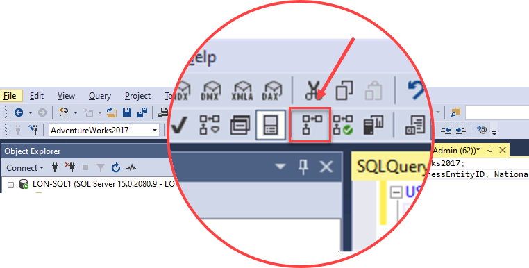
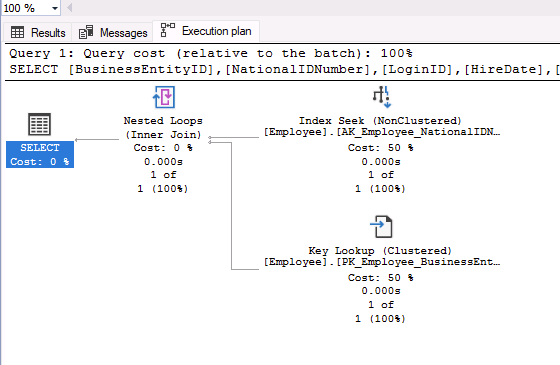

---
lab:
  title: 'ラボ 9: データベース設計の問題を特定する'
  module: Optimize query performance in Azure SQL
---

# <a name="identify-database-design-issues"></a>データベース設計の問題を特定する

**推定所要時間: 15 分**

学生は、レッスンで得た情報を利用して、AdventureWorks 内のデジタルトランスフォーメーション プロジェクトの成果物を調べます。 受講生は、Azure portal と他のツールを調べ、ネイティブ ツールを利用してパフォーマンス関連の問題を特定して解決する方法を決定します。 最後に、受講者は、正規化、データ型の選択、インデックス設計の問題について、データベース設計を評価できるようになります。

あなたは、パフォーマンス関連の問題を見つけ出して、見つかった問題を解決するための実用的ソリューションを提供するデータベース管理者として雇用されています。 AdventureWorks は、10 年以上にわたって自転車と自転車部品を消費者と販売業者に直接販売しています。 あなたの仕事は、このモジュールで学習した手法を使用して、クエリのパフォーマンスの問題を明らかにし、解決することです。

**注:** これらの演習では、T-SQL コードをコピーして貼り付けるように求められます。 コードを実行する前に、コードを正しくコピーしていることを確認してください。

## <a name="restore-a-database"></a>データベースを復元する

1. **https://github.com/MicrosoftLearning/dp-300-database-administrator/blob/master/Instructions/Templates/AdventureWorks2017.bak** にあるデータベース バックアップ ファイルをラボ仮想マシンの **C:\LabFiles\Monitor and optimize** パス (存在しない場合は、このフォルダー構造を作成します) にダウンロードします。

    

1. Windows の [スタート] ボタンを選択し、SSMS と入力します。 一覧から **[Microsoft SQL Server Management Studio 18]** を選択します。  

    

1. SSMS が開くと、 **[サーバーに接続]** ダイアログに既定のインスタンス名が事前に入力されていることがわかります。 **[接続]** を選択します。

    

1. **Databases** フォルダーを選択し、 **[新しいクエリ]** を選択します。

    

1. 次の T-SQL をコピーして、新しいクエリ ウィンドウに貼り付けます。 クエリを実行してデータベースを復元します。

    ```sql
    RESTORE DATABASE AdventureWorks2017
    FROM DISK = 'C:\LabFiles\Monitor and optimize\AdventureWorks2017.bak'
    WITH RECOVERY,
          MOVE 'AdventureWorks2017' 
            TO 'C:\LabFiles\Monitor and optimize\AdventureWorks2017.mdf',
          MOVE 'AdventureWorks2017_log'
            TO 'C:\LabFiles\Monitor and optimize\AdventureWorks2017_log.ldf';
    ```

    **注:** データベース バックアップ ファイルの名前とパスは、手順 1 でダウンロードしたものと一致している必要があります。そうでない場合、コマンドは失敗します。

1. 復元が完了すると、成功メッセージが表示されます。

    

## <a name="examine-the-query-and-identify-the-problem"></a>クエリを調べて問題を識別する

1. **[新しいクエリ]** を選択します。 次の T-SQL コードをコピーして、クエリ ウィンドウに貼り付けます。 **[実行]** を選択してこのクエリを実行します。

    ```sql
    USE AdventureWorks2017
    GO
    
    SELECT BusinessEntityID, NationalIDNumber, LoginID, HireDate, JobTitle
    FROM HumanResources.Employee
    WHERE NationalIDNumber = 14417807;
    ```

1. クエリを実行する前に、次に示す **[実際の実行プランを含める]** アイコンを選択するか、**CTRL + M** キーを押します。 これにより、クエリを実行すると実行プランが表示されるようになります。 **[実行]** を選択してこのクエリを実行します。

    

1. SSMS の結果パネルで **[実行プラン]** タブを選択して、実行プランに移動します。 実行プラン内で、`SELECT` 演算子にマウスを合わせます。 次に示すように、中に感嘆符が描かれた黄色の三角形で識別される警告メッセージに気付くでしょう。 警告メッセージの内容を確認します。

    

## <a name="identify-ways-to-fix-the-warning-message"></a>警告の問題を解決する方法を特定する

*[HumanResources].[Employee]* テーブルの構造は、次のデータ定義言語 (DDL) ステートメントで示されます。 前の SQL クエリで使用されているフィールドを、その型に注意しながらこの DDL で確認します。

```sql
CREATE TABLE [HumanResources].[Employee](
     [BusinessEntityID] [int] NOT NULL,
     [NationalIDNumber] [nvarchar](15) NOT NULL,
     [LoginID] [nvarchar](256) NOT NULL,
     [OrganizationNode] [hierarchyid] NULL,
     [OrganizationLevel] AS ([OrganizationNode].[GetLevel]()),
     [JobTitle] [nvarchar](50) NOT NULL,
     [BirthDate] [date] NOT NULL,
     [MaritalStatus] [nchar](1) NOT NULL,
     [Gender] [nchar](1) NOT NULL,
     [HireDate] [date] NOT NULL,
     [SalariedFlag] [dbo].[Flag] NOT NULL,
     [VacationHours] [smallint] NOT NULL,
     [SickLeaveHours] [smallint] NOT NULL,
     [CurrentFlag] [dbo].[Flag] NOT NULL,
     [rowguid] [uniqueidentifier] ROWGUIDCOL NOT NULL,
     [ModifiedDate] [datetime] NOT NULL
) ON [PRIMARY]
```

1. 実行プランに表示された警告メッセージに従って、どのような変更を推奨しますか?

    1. 暗黙的な変換の原因となっているフィールドとその理由を識別します。 
    1. クエリを見てみましょう。

        ```sql
        SELECT BusinessEntityID, NationalIDNumber, LoginID, HireDate, JobTitle
        FROM HumanResources.Employee
        WHERE NationalIDNumber = 14417807;
        ```

        **14417807** は、引用符で囲まれた文字列に含まれていないため、`WHERE` 句の *NationalIDNumber* 列と比較される値は数値として比較されることに注意してください。 

        テーブル構造を調べると、*NationalIDNumber* 列では、`INT` データ型ではなく `NVARCHAR` データ型が使用されていることがわかります。 この不整合により、データベース オプティマイザーは、数値を `NVARCHAR` に暗黙的に変換します。その結果、最適ではないプランが作成され、クエリのパフォーマンスに追加のオーバーヘッドが発生します。

暗黙的な変換の警告を修正するために実装できる方法が 2 つあります。 次の手順では、これらの各方法を調査します。

### <a name="change-the-code"></a>コードを変更する

1. 暗黙の変換を解決するには、コードをどのように変更しますか? コードを変更し、クエリを再実行します。

    まだであれば、 **[実際の実行プランを含める]** をオンにする (**CTRL + M** キー) ことを忘れないでください。 

    このシナリオでは、値の両側に一重引用符を追加するだけで、値が数値から文字形式に変更されます。 このクエリのクエリ ウィンドウを開いたままにしておきます。

    更新された SQL クエリを実行します。

    ```sql
    SELECT BusinessEntityID, NationalIDNumber, LoginID, HireDate, JobTitle
    FROM HumanResources.Employee
    WHERE NationalIDNumber = '14417807';
    ```

    

    **注:** 警告メッセージが消え、クエリ プランが改善されています。 *NationalIDNumber* 列と比較される値がテーブル内の列のデータ型と一致するように `WHERE` 句を変更すると、オプティマイザーでの暗黙的な変換を取り除くことができました。

### <a name="change-the-data-type"></a>データ型を変更する

1. テーブル構造を変更することで、暗黙的な変換の警告を修正することもできます。

    インデックスの修正を試みるには、次のクエリをコピーして新しいクエリ ウィンドウに貼り付けて、列のデータ型を変更します。 **[実行]** を選択するか、<kbd>F5</kbd> キーを押して、クエリの実行を試みます。

    ```sql
    ALTER TABLE [HumanResources].[Employee] ALTER COLUMN [NationalIDNumber] INT NOT NULL;
    ```

    *NationalIDNumber* 列のデータ型を INT に変更すると、変換の問題が解決されます。 ただし、この変更により、データベース管理者として解決する必要のある別の問題が発生します。

    

    *NationalIDNumber* 列は既に存在する非クラスター化インデックスの一部であるため、データ型を変更するにはインデックスを再構築または再作成する必要があります。 **これにより、運用環境でのダウンタイムが長くなる可能性があります。これは、設計で適切なデータ型を選択することの重要性を浮き彫りにするものです。**

1. この問題を解決するには、次のコードをコピーしてクエリ ウィンドウに貼り付け、**[実行]** を選択して実行します。

    ```sql
    USE AdventureWorks2017
    GO
    
    --Dropping the index first
    DROP INDEX [AK_Employee_NationalIDNumber] ON [HumanResources].[Employee]
    GO

    --Changing the column data type to resolve the implicit conversion warning
    ALTER TABLE [HumanResources].[Employee] ALTER COLUMN [NationalIDNumber] INT NOT NULL;
    GO

    --Recreating the index
    CREATE UNIQUE NONCLUSTERED INDEX [AK_Employee_NationalIDNumber] ON [HumanResources].[Employee]( [NationalIDNumber] ASC );
    GO
    ```

1. または、次のクエリを実行して、データ型が正常に変更されたことを確認できます。

    ```sql
    SELECT c.name, t.name
    FROM sys.all_columns c INNER JOIN sys.types t
        ON (c.system_type_id = t.user_type_id)
    WHERE OBJECT_ID('[HumanResources].[Employee]') = c.object_id
        AND c.name = 'NationalIDNumber'
    ```
    
    
    
1. ここで、実行プランを確認してみましょう。 引用符のない元のクエリを再実行します。

    ```sql
    USE AdventureWorks2017
    GO

    SELECT BusinessEntityID, NationalIDNumber, LoginID, HireDate, JobTitle
    FROM HumanResources.Employee
    WHERE NationalIDNumber = 14417807;
    ```

    

    クエリ プランを調べると、暗黙的な変換の警告が表示されることなく、整数を使用して *NationalIDNumber* でフィルター処理できるようになったことがわかります。 これで、SQL クエリ オプティマイザーで最適なプランを生成して実行できるようになりました。

この演習では、暗黙的なデータ型変換によって発生するクエリの問題を特定する方法、およびクエリの問題を修正してクエリ プランを改善する方法について学習しました。
