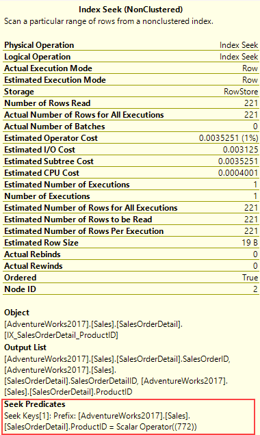
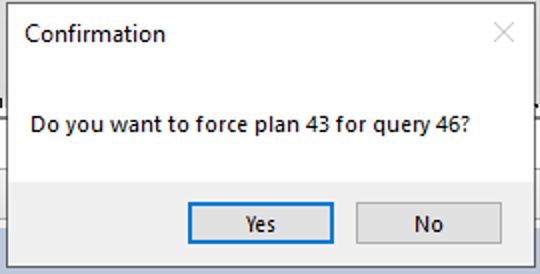

---
lab:
  title: 'ラボ 10: SQL Database で低パフォーマンス クエリの問題領域を分離する'
  module: Optimize query performance in Azure SQL
---

# <a name="isolate-problem-areas-in-poorly-performing-queries-in-a-sql-database"></a>SQL Database で低パフォーマンス クエリの問題領域を分離する

**推定所要時間:30 分**

あなたは、ユーザーが *AdventureWorks2017* データベースのクエリを実行するときに現在発生しているパフォーマンスの問題に対処するために、シニア データベース管理者として採用されました。 あなたの仕事は、このモジュールで学習した手法を使用して、クエリのパフォーマンスの問題を明らかにし、解決することです。

最適ではないパフォーマンスのクエリを実行し、クエリ プランを調べて、データベース内で改良を行います。

**注:** これらの演習では、T-SQL コードをコピーして貼り付けるように求められます。 コードを実行する前に、コードを正しくコピーしていることを確認してください。

## <a name="restore-a-database"></a>データベースを復元する

1. **https://github.com/MicrosoftLearning/dp-300-database-administrator/blob/master/Instructions/Templates/AdventureWorks2017.bak** にあるデータベース バックアップ ファイルをラボ仮想マシンの **C:\LabFiles\Monitor and optimize** パス (存在しない場合は、このフォルダー構造を作成します) にダウンロードします。

    

1. Windows の [スタート] ボタンを選択し、SSMS と入力します。 一覧から **[Microsoft SQL Server Management Studio 18]** を選択します。  

    

1. SSMS が開くと、 **[サーバーに接続]** ダイアログに既定のインスタンス名が事前に入力されていることがわかります。 **[接続]** を選択します。

    

1. **Databases** フォルダーを選択し、 **[New Query]** を選択します。

    

1. 次の T-SQL をコピーして、新しいクエリ ウィンドウに貼り付けます。 クエリを実行してデータベースを復元します。

    ```sql
    RESTORE DATABASE AdventureWorks2017
    FROM DISK = 'C:\LabFiles\Monitor and optimize\AdventureWorks2017.bak'
    WITH RECOVERY,
          MOVE 'AdventureWorks2017' 
            TO 'C:\LabFiles\Monitor and optimize\AdventureWorks2017.mdf',
          MOVE 'AdventureWorks2017_log'
            TO 'C:\LabFiles\Monitor and optimize\AdventureWorks2017_log.ldf';
    ```

    **注:** データベース バックアップ ファイルの名前とパスは、手順 1 でダウンロードしたものと一致している必要があります。そうでない場合、コマンドは失敗します。

1. 復元が完了すると、成功メッセージが表示されます。

    

## <a name="generate-actual-execution-plan"></a>実際の実行プランを生成する

SQL Server Management Studio で実行プランを生成するには、いくつかの方法があります。

1. **[New Query]** を選択します。 次の T-SQL コードをコピーして、クエリ ウィンドウに貼り付けます。 **[Execute]** を選択してこのクエリを実行します。

    **注:** クエリの実行プランは、個別のタブにグラフィカルに表示するのではなく、**SHOWPLAN_ALL** を使用して、テキスト バージョンを結果ペインに表示します。

    ```sql
    USE AdventureWorks2017;
    GO

    SET SHOWPLAN_ALL ON;
    GO

    SELECT BusinessEntityID
    FROM HumanResources.Employee
    WHERE NationalIDNumber = '14417807';
    GO

    SET SHOWPLAN_ALL OFF;
    GO
    ```

    **SELECT** ステートメントの実際のクエリ結果ではなく、実行プランのテキスト バージョンが表示されます。

    

1. 少し時間を取って、**StmtText** 列の 2 行目のテキストを調べます。

    ```console
    |--Index Seek(OBJECT:([AdventureWorks2017].[HumanResources].[Employee].[AK_Employee_NationalIDNumber]), SEEK:([AdventureWorks2017].[HumanResources].[Employee].[NationalIDNumber]=CONVERT_IMPLICIT(nvarchar(4000),[@1],0)) ORDERED FORWARD)
    ```

    上記のテキストは、この実行プランでは **AK_Employee_NationalIDNumber** キーに対して **Index Seek** が使用されていることを説明しています。 また、実行プランで **CONVERT_IMPLICIT** 手順を行う必要があったことも示しています。

    クエリ オプティマイザーは、必要なレコードをフェッチするために適切なインデックスを見つけることができました。

## <a name="resolve-a-suboptimal-query-plan"></a>最適でないクエリ プランを解決する

1. 次のコードをコピーして、新しいクエリ ウィンドウに貼り付けます。

    クエリを実行する前に、次に示すように **[実際の実行プランを含める]** アイコンを選択するか、<kbd>Ctrl-M</kbd> キーを押します。 **[Execute]** を選択するか、<kbd>F5</kbd> キーを押して、クエリを実行します。 実行プランと、[メッセージ] タブの論理読み取り数を記録しておきます。

    ```sql
    SET STATISTICS IO, TIME ON;

    SELECT [SalesOrderID] ,[CarrierTrackingNumber] ,[OrderQty] ,[ProductID], [UnitPrice] ,[ModifiedDate]
    FROM [AdventureWorks2017].[Sales].[SalesOrderDetail]
    WHERE [ModifiedDate] > '2012/01/01' AND [ProductID] = 772;
    ```

    

    実行プランを確認すると、**Key Lookup**があることがわかります。 そのアイコンをマウスでポイントすると、クエリによって取得された行ごとにそれが実行されることがプロパティで示されます。 実行プランで**Key Lookup**操作が実行されていることを確認できます。

    

    **[出力リスト]** セクションの列をメモします。 このクエリをどのように改善しますか?

    Key Lookupを削除するために変更する必要があるインデックスを特定するには、その上のインデックス シークを調べる必要があります。 インデックス シーク オペレーターをマウスでポイントすると、オペレーターのプロパティが表示されます。

    

1. クエリで返される、または検索されるすべてのフィールドを含む対象とするインデックスを追加することで、**Key Lookup**を削除できます。 この例のインデックスでは、**ProductID** 列のみが使用されています。 **Key Lookup**を修正し、クエリを再実行して新しいプランを表示します。

    ```sql
    CREATE NONCLUSTERED INDEX [IX_SalesOrderDetail_ProductID] ON [Sales].[SalesOrderDetail]
    ([ProductID] ASC)
    ```

    含まれる列として**出力リスト**のフィールドをインデックスに追加すると、**Key Lookup**が削除されます。 インデックスは既に存在するので、インデックスを削除して作成し直すか、列を追加するために **DROP_EXISTING=ON** を設定する必要があります。 **ProductID** 列は既にインデックスの一部であり、含まれる列として追加する必要はないことに注意してください。 **ModifiedDate** を追加することにより、インデックスのパフォーマンスをさらに向上させることができます。

    ```sql
    CREATE NONCLUSTERED INDEX [IX_SalesOrderDetail_ProductID]
    ON [Sales].[SalesOrderDetail] ([ProductID],[ModifiedDate])
    INCLUDE ([CarrierTrackingNumber],[OrderQty],[UnitPrice])
    WITH (DROP_EXISTING = on);
    GO
    ```

1. ステップ 1 からクエリを再実行します。 論理読み取り数の変化と実行プランの変更を記録しておきます。 プランで使用する必要があるのは、作成した非クラスター化インデックスのみになりました。

    

## <a name="use-query-store-to-detect-and-handle-regression"></a>クエリ ストアを使用して回帰を検出して処理する

次に、ワークロードを実行して、クエリ ストアのクエリ統計を生成し、**リソースを消費するクエリの上位**レポートを調べて低パフォーマンスを特定し、より優れた実行プランを強制する方法を確認します。

1. **[New Query]** を選択します。 次の T-SQL コードをコピーして、クエリ ウィンドウに貼り付けます。 **[Execute]** を選択してこのクエリを実行します。

    このスクリプトにより、クエリ ストア機能が AdventureWorks2017 データベースに対して有効になり、データベースの互換レベルが 100 に設定されます。

    ```sql
    USE [master];
    GO

    ALTER DATABASE [AdventureWorks2017] SET QUERY_STORE = ON;
    GO

    ALTER DATABASE [AdventureWorks2017] SET QUERY_STORE (OPERATION_MODE = READ_WRITE);
    GO

    ALTER DATABASE [AdventureWorks2017] SET COMPATIBILITY_LEVEL = 100;
    GO
    ```

    互換レベルの変更は、データベースの時間を戻すことに似ています。 これにより、SQL Server で使用できる機能が、SQL Server 2008 で使用できるものに制限されます。

1. **https://github.com/MicrosoftLearning/dp-300-database-administrator/blob/master/Instructions/Templates/CreateRandomWorkloadGenerator.sql** にある T-SQL スクリプトをラボの仮想マシンの **C:\LabFiles\Monitor and optimize** パスにダウンロードします。

1. **https://github.com/MicrosoftLearning/dp-300-database-administrator/blob/master/Instructions/Templates/ExecuteRandomWorkload.sql** にある T-SQL スクリプトをラボの仮想マシンの **C:\LabFiles\Monitor and optimize** パスにダウンロードします。

1. SQL Server Management Studio で **[ファイル]********[開く]********[ファイル]** を選択します。

1. **C:\LabFiles\Monitor and optimize\CreateRandomWorkloadGenerator.sql** ファイルに移動します。

1. SQL Server Management Studio で開いたら、 **[Execute]** を選択するか、<kbd>F5</kbd> キーを押してクエリを実行します。

1. 新しいクエリ エディターで、ファイル **C:\LabFiles\Monitor and optimize\ExecuteRandomWorkload.sql**を開き、 **[Execute]** を選択するか、<kbd>F5</kbd> キーを押してクエリを実行します。

1. 実行が完了したら、スクリプトをもう一度実行して、サーバーにさらに負荷を加えます。 このクエリのクエリ タブは開いたままにします。

1. 次のコードをコピーして新しいクエリ ウィンドウに貼り付け、**[Execute]** を選択するか、<kbd>F5</kbd> キーを押して実行します。 

    このスクリプトにより、データベース互換モードが SQL Server 2019 (**150**) に変更されます。 これで、SQL Server 2008 以降のすべての機能と機能強化をデータベースで使用できるようになりました。

    ```sql
    USE [master];
    GO

    ALTER DATABASE [AdventureWorks2017] SET COMPATIBILITY_LEVEL = 150;
    GO
    ```

1. **ExecuteRandomWorkload.sql** ファイルからクエリ タブに戻り、もう一度実行します。

## <a name="examine-top-resource-consuming-queries-report"></a>リソースを消費する上位のクエリのレポートを調べる

1. クエリ ストア ノードを表示するには、SQL Server Management Studio で AdventureWorks2017 データベースを更新する必要があります。 データベース名を右クリックし、 **[更新]** を選択します。 データベースの下に [クエリ ストア] ノードが表示されます。

    ![[クエリ ストア] を展開する](../images/dp-300-module-10-lab-06.png)

1. **[クエリ ストア]** ノードを展開すると、使用可能なすべてのレポートが表示されます。 **[リソースを消費するクエリの上位]** レポートを選択します。

    

1. 次に示すようなレポートが開きます。 右側のメニュー ドロップダウンを選択し、**[構成]** を選択します。

    

1. 構成画面で、クエリ プランの最小数のフィルターを 2 に変更します。 **[OK]** をクリックします。

    

1. レポートの左上にある棒グラフの左端にある棒を選択して、期間が最も長いクエリを選択します。

    

    これにより、クエリ ストア内の最長クエリのクエリとプランの概要が表示されます。

## <a name="force-a-better-execution-plan"></a>より適切な実行プランを強制する

1. 次に示すように、レポートのプラン概要部分に移動します。 期間が大きく異なる 2 つの実行プランがあることに注意してください。

    

1. レポートの右上のウィンドウで、期間が最も短いプラン ID を選択します (これは、グラフの Y 軸の下側にある位置で示されます)。 上のグラフで、これは *PlanID 43* です。 プランの概要グラフの横にあるプラン ID を選択します (上のスクリーンショットのように強調表示する必要があります)。

1. 概要グラフの **[プランの強制]** を選択します。 確認ウィンドウが表示されたら、 **[はい]** を選択します。

    

    プランが強制されたら、 **[強制されたプラン]** は淡色表示され、プランの概要ウィンドウのプランに、強制されたことを示すチェック マークが付けられます。

    クエリ オプティマイザーによって使用するように選択された実行プランが、適切ではない場合があります。 このような状況が発生した場合、パフォーマンスがもっとよいプランがわかっているときは、それを使用するように SQL Server に強制することができます。

## <a name="use-query-hints-to-impact-performance"></a>クエリ ヒントを使用してパフォーマンスに影響を与えます

次に、ワークロードを実行し、パラメーターを使用するようにクエリを変更し、クエリ ヒントをクエリに適用して、再実行します。

演習を続ける前に、**[ウィンドウ]** メニューを選択して現在のクエリ ウィンドウをすべて閉じ、**[すべてのドキュメントを閉じる]** を選択します。 ポップアップで **[いいえ]** を選択します。

1. **[New Query]** を選択し、クエリを実行する前に **[実際の実行プランを含める]** アイコンを選択するか、<kbd>CTRL</kbd> + <kbd>M</kbd> キーを使用します。

    ![[実際の実行プランを含める]](../images/dp-300-module-10-lab-13.png)

1. 次のクエリを実行します。 実行プランでインデックス シーク オペレーターが示されていることに注意してください。

    ```sql
    USE AdventureWorks2017;
    GO

    SELECT SalesOrderId, OrderDate
    FROM Sales.SalesOrderHeader
    WHERE SalesPersonID=288;
    ```

    

1. 新しいクエリ ウィンドウで、次のクエリを実行します。 両方の実行プランを比較します。

    ```sql
    USE AdventureWorks2017;
    GO

    SELECT SalesOrderId, OrderDate
    FROM Sales.SalesOrderHeader
    WHERE SalesPersonID=277;
    ```

    今回の変更は、SalesPersonID の値が 277 に設定されていることだけです。 実行プランのクラスター化インデックス スキャン操作に注意してください。

    

ご覧のとおり、`WHERE` 句の値が異なるため、クエリ オプティマイザーでは、インデックス統計に基づいて、別の実行プランが選択されています。

変更したのは *SalesPersonID* の値のみであるのに、なぜ異なるプランが存在するのでしょうか?

このクエリでは `WHERE` 句で定数が使用されているため、オプティマイザーでは、これらのクエリはそれぞれ一意と見なされ、毎回異なる実行プランが生成されます。

## <a name="change-the-query-to-use-a-variable-and-use-a-query-hint"></a>変数とクエリ ヒントを使用するようにクエリを変更する

1. SalesPersonID に変数値を使用するようにクエリを変更します。

1. T-SQL の **DECLARE** ステートメントを使用して <strong>@SalesPersonID</strong> を宣言し、**WHERE** 句の値をハードコーディングするのではなく、値を渡すことができるようにします。 暗黙的な変換を回避するには、変数のデータ型をターゲット テーブルの列のデータ型と一致させる必要があります。

    ```sql
    USE AdventureWorks2017;
    GO

    SET STATISTICS IO, TIME ON;

    DECLARE @SalesPersonID INT;

    SELECT @SalesPersonID = 288;

    SELECT SalesOrderId, OrderDate
    FROM Sales.SalesOrderHeader
    WHERE SalesPersonID= @SalesPersonID;
    ```

    実行プランを調べると、インデックス スキャンを使用して結果を取得していることがわかります。 クエリ オプティマイザーは、実行時までローカル変数の値がわからないので、適切な最適化を行うことができませんでした。

1. クエリ ヒントを提供することにより、クエリ オプティマイザーでより適切な選択が行われるようにすることができます。 `OPTION (RECOMPILE)` を使用して上記のクエリを再度実行します。

    ```sql
    USE AdventureWorks2017
    GO

    SET STATISTICS IO, TIME ON;

    DECLARE @SalesPersonID INT;

    SELECT @SalesPersonID = 288;

    SELECT SalesOrderId, OrderDate
    FROM Sales.SalesOrderHeader
    WHERE SalesPersonID= @SalesPersonID
    OPTION (RECOMPILE);
    ```

    クエリ オプティマイザーで、より効率的な実行プランを選択できるようになったことに注意してください。 `RECOMPILE` オプションを指定すると、クエリ コンパイラによって変数がその値に置き換えられます。

    [メッセージ] タブで統計を比較すると、クエリ ヒントを使用しないクエリの方が、論理読み取り数が **68%** 多い (689 対 409) ことがわかります。

この演習では、クエリの問題を特定する方法と、それを修正してクエリ プランを改善する方法を学習しました。
