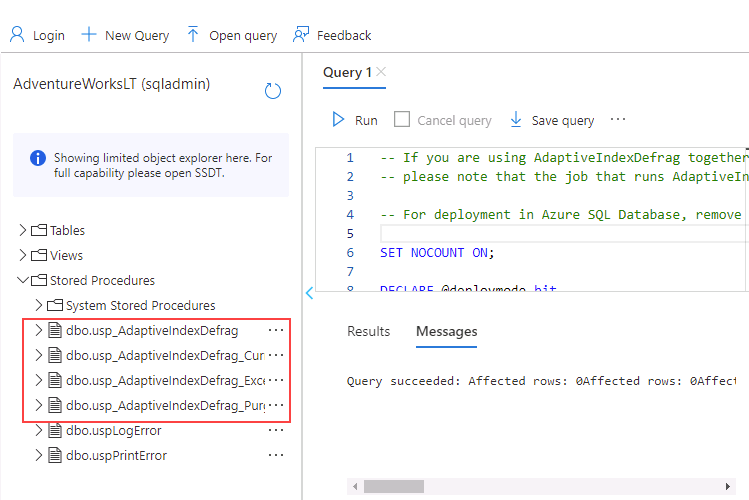
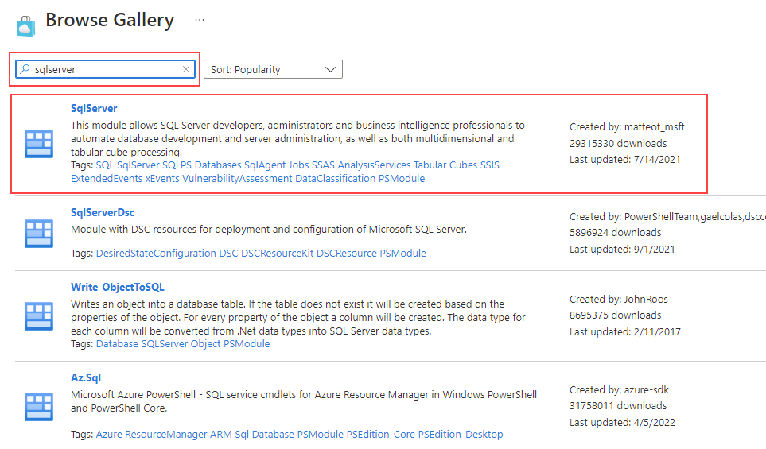
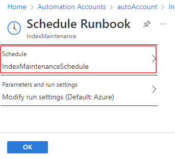

---
lab:
  title: ラボ 13 – Automation Runbook をデプロイして、インデックスを自動的に再構築する
  module: Automate database tasks for Azure SQL
---

# Automation Runbook をデプロイして、インデックスを自動的に再構築する

**推定所要時間:30 分**

あなたは、データベース管理の日常業務自動化を支援するシニア データベース管理者として採用されました。 この自動化はピーク時のパフォーマンスで AdventureWorks のデータベースの稼働を確実に続けるうえで役に立つだけでなく、特定の条件に基づいてアラートを生成することもできるようにします。 AdventureWorks では、サービスとしてのインフラストラクチャ (IaaS) とサービスとしてのプラットフォーム (PaaS) の両方のオファリングで SQL Server を利用しています。

## Automation アカウントを作成する

1. ラボの仮想マシンからブラウザー セッションを開始し、[https://portal.azure.com](https://portal.azure.com/) に移動します。 このラボ仮想マシンの **[リソース]** タブで提供されている Azure の **[ユーザー名]** と **[パスワード]** を使用してポータルに接続します。

    

1. Azure portal の検索バーに「*automation*」と入力し、検索結果から **[Automation アカウント]** を選択して、 **[+ 作成]** を選択します。

    

1. **[Automation アカウントの作成]** ページで、次の詳細を入力して、 **[確認と作成]** を選択します。

    - **リソース グループ:** &lt;お使いのリソース グループ&gt;
    - **名前:** autoAccount
    - **場所:** 既定値を使用します。

    ![[Automation アカウントの追加] 画面のスクリーンショット。](../images/dp-300-module-13-lab-02.png)

1. [レビュー] ページで、 **[作成]** を選択します。

    ![[Automation アカウントの追加] 画面のスクリーンショット。](../images/dp-300-module-13-lab-29.png)

    > [!NOTE]
    > Automation アカウントは約 3 分で作成されます。

## 既存の Azure SQL Database に接続する

1. Azure portal 内で、「**sql データベース**」を検索して、自分のデータベースに移動します。

    

1. SQL データベース **AdventureWorksLT** を選択します。

    

1. SQL Database ページのメイン セクションで、 **[クエリ エディター (プレビュー)]** を選択します。

    ![[クエリ エディター (プレビュー)] を選択しているスクリーンショット。](../images/dp-300-module-13-lab-05.png)

1. データベースにサインインするための資格情報を入力するように求められます。 次の資格情報を使用します。

    - **ログイン:** sqladmin
    - **パスワード:** P@ssw0rd01

1. 次のエラー メッセージが表示されます。

    

1. 上記のエラー メッセージの最後にある **[許可リスト IP ...]** リンクを選択します。 これにより、クライアント IP が SQL Database のファイアウォール規則エントリとして自動的に追加されます。

    

1. クエリ エディターに戻り、 **[OK]** を選択して、データベースにサインインします。

1. ブラウザーで新しいタブを開き、GitHub ページに移動して、[**AdaptativeIndexDefragmentation**](https://github.com/microsoft/tigertoolbox/blob/master/AdaptiveIndexDefrag/usp_AdaptiveIndexDefrag.sql) スクリプトにアクセスします。 次に、 **[Raw]** を選択します。

     を選択しているスクリーンショット。](../images/dp-300-module-13-lab-08.png)

    これにより、コピー可能な形式でコードが提供されます。 すべてのテキストを選択し ( <kbd>CTRL</kbd> + <kbd>A</kbd> )、クリップボードにコピーします ( <kbd>CTRL</kbd> + <kbd>C</kbd> )。

    >[!NOTE]
    > このスクリプトの目的は、1 つ以上のデータベースに対して、1 つ以上のインデックスのインテリジェントな最適化と、必要な統計情報の更新を実行することです。

1. GitHub ブラウザー タブを閉じ、Azure portal に戻ります。

1. コピーしたテキストを **[クエリ 1]** ペインに貼り付けます。

    

1. クエリの 5 行目と 6 行目の `USE msdb` と `GO` (スクリーンショットで強調表示されています) を削除し、**[実行]** を選択します。

1. **[ストアド プロシージャ]** フォルダーを展開して、作成された内容を確認します。

    

## Automation アカウント資産を構成する

次の手順で、Runbook の作成準備として必要な資産を構成します。 次に、**[Automation アカウント]** を選択します。

1. Azure portal 上で、上部の検索ボックスに「**automation**」と入力します。

    

1. 作成した Automation アカウントを選択します。

    

1. Automation ブレードの **[共有リソース]** セクションで、 **[モジュール]** を選択します。 **[ギャラリーの参照]** を選択します。

    ![[モジュール] メニューを選択しているスクリーンショット。](../images/dp-300-module-13-lab-13.png)

1. ギャラリー内で **sqlserver** を検索します。

    

1. **SqlServer** を選択すると、次の画面に移動するので、 **[選択]** を選択します。

    ![[選択] を選択しているスクリーンショット。](../images/dp-300-module-13-lab-15.png)

1. **[モジュールの追加]** ページで、使用可能な最新のランタイム バージョンを選択し、 **[インポート]** を選択します。 これにより、PowerShell モジュールが Automation アカウントにインポートされます。

    ![[インポート] を選択しているスクリーンショット。](../images/dp-300-module-13-lab-16.png)

1. データベースに安全にサインインするには、資格情報を作成する必要があります。 Automation アカウントのブレードから、**[共有リソース]** セクションに移動し、**[資格情報]** を選択します。

    ![[資格情報] オプションを選択しているスクリーンショット。](../images/dp-300-module-13-lab-17.png)

1. **[+ 資格情報の追加]** を選択し、以下の情報を入力して、 **[作成]** を選択します。

    - 名前: **SQLUser**
    - ユーザー名: **sqladmin**
    - パスワード: **P@ssw0rd01**
    - パスワードの確認: **P@ssw0rd01**

    

## PowerShell Runbook を作成する

1. Azure portal 内で、「**sql データベース**」を検索して、自分のデータベースに移動します。

    

1. SQL データベース **AdventureWorksLT** を選択します。

    

1. **[概要]** ページで、次に示すように、Azure SQL データベースの **[サーバー名]** をコピーします (サーバー名は *dp300-lab* で始まるはずです)。 これは後の手順で貼り付けます。

    

1. Azure portal 上で、上部の検索ボックスに「**automation**」と入力します。

    

1. 作成した Automation アカウントを選択します。

    

1. Automation アカウント ブレードの **[プロセス オートメーション]** セクションまでスクロールし、 **[Runbook]** 、 **[+ Runbook の作成]** の順に選択します。

    ![[Runbook の作成] を選択している [Runbook] ページのスクリーンショット。](../images/dp-300-module-13-lab-20.png)

    >[!NOTE]
    > 学習したように、2 つの既存の Runbook が作成されていることに注意してください。 これらは、Automation アカウントのデプロイ中に自動的に作成されました。

1. Runbook の名前として「**IndexMaintenance**」を、Runbook の種類として「**PowerShell**」を入力します。 使用可能な最新のランタイム バージョンを選択し、 **[作成]** を選択します。

    

1. Runbook が作成されたら、以下の PowerShell コード スニペットをコピーして Runbook エディターに貼り付けます。 スクリプトの 1 行目に、上記の手順でコピーしたサーバー名を貼り付けます。 **[保存]** を選択してから、**[公開]** を選択します。

    **メモ:** Runbook を保存する前に、コードが正しくコピーされていることを確認してください。

    ```powershell
    $AzureSQLServerName = ''
    $DatabaseName = 'AdventureWorksLT'
    
    $Cred = Get-AutomationPSCredential -Name "SQLUser"
    $SQLOutput = $(Invoke-Sqlcmd -ServerInstance $AzureSQLServerName -UserName $Cred.UserName -Password $Cred.GetNetworkCredential().Password -Database $DatabaseName -Query "EXEC dbo.usp_AdaptiveIndexDefrag" -Verbose) 4>&1

    Write-Output $SQLOutput
    ```

    

1. すべてが問題なければ、成功メッセージを受け取るはずです。

    

## Runbook のスケジュールの作成

次に、Runbook をスケジュールして定期的に実行されるようにします。

1. **IndexMaintenance** Runbook の左側のナビゲーションにある **[リソース]** の下で、 **[スケジュール]** を選択します。 次に、**[+ スケジュールの追加]** を選択します。

    ![[スケジュールの追加] を選択している[スケジュール] ページのスクリーンショット。](../images/dp-300-module-13-lab-24.png)

1. **[スケジュールを Runbook にリンクします]** を選択します。

    ![[スケジュールを Runbook にリンクします] を選択しているスクリーンショット。](../images/dp-300-module-13-lab-25.png)

1. **[+ スケジュールの追加]** を選択します。

    

1. 必要に応じて、わかりやすいスケジュール名と説明を入力します。

1. 翌日の**午前 4 時 00 分**の開始時刻を**太平洋時間**のタイム ゾーンで指定します。 **1** 日ごとの繰り返しを構成します。 有効期限は設定しないでください。

    ![情報例が入力された [新しいスケジュール] ポップアウトのスクリーンショット。](../images/dp-300-module-13-lab-27.png)

1. **[作成]** を選択してから **[OK]** を選択します。

1. これでスケジュールが作成され、Runbook にリンクされました。 **[OK]** を選択します。

    

Azure Automation から、Azure 環境と非 Azure 環境にわたって一貫した管理をサポートするクラウドベースのオートメーションと構成サービスが提供されています。

この演習を完了することで、SQL サーバー データベースのインデックスの最適化を、毎日午前 4 時に実行するように自動化しました。