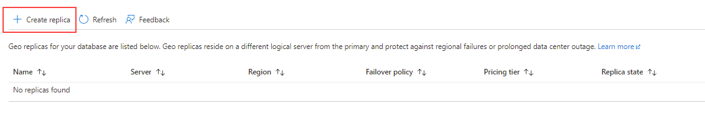
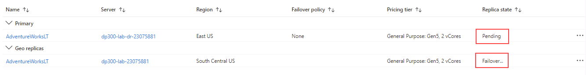

---
lab:
  title: ラボ 14 – Azure SQL Database 用に geo レプリケーションを構成する
  module: Plan and implement a high availability and disaster recovery solution
---

# Azure SQL Database 用に geo レプリケーションを構成する

**推定所要時間:30 分**

AdventureWorks 内の DBA として、Azure SQL Database の geo レプリケーションを有効にし、それが適切に機能していることを確認する必要があります。 さらに、ポータルを使用して別のリージョンに手動でフェールオーバーします。

## geo レプリケーションを有効にする

1. ラボの仮想マシンからブラウザー セッションを開始し、[https://portal.azure.com](https://portal.azure.com/) に移動します。 このラボ仮想マシンの **[リソース]** タブで提供されている Azure の **[ユーザー名]** と **[パスワード]** を使用してポータルに接続します。

    

1. Azure portal 内で、「**sql データベース**」を検索して、自分のデータベースに移動します。

    

1. SQL データベース **AdventureWorksLT** を選択します。

    

1. データベースのブレードの **[データ管理]** セクションで、 **[レプリカ]** を選択します。

    

1. **[+ レプリカの作成]** を選択します。

    

1. **[SQL Database - geo レプリカの作成]** ページの **[サーバー]** で、 **[新規作成]** リンクを選択します。

    

    >[!NOTE]
    > セカンダリ データベースをホストする新しいサーバーを作成するので、上記のエラー メッセージは無視してかまいません。

1. **[SQL Database サーバーの作成]** ページで、任意の一意な**サーバー名**、有効な**サーバー管理者ログイン**、安全な**パスワード**を入力します。 ターゲット リージョンとしての**場所**を選び、 **[OK]** を選択してサーバーを作成します。

    ![[SQL Database サーバーの作成] ページを示すスクリーンショット。](../images/dp-300-module-14-lab-04.png)

1. **[SQL Database- geo レプリカの作成]** ページに戻り、 **[確認および作成]** を選択します。

    ![[SQL Database サーバーの作成] ページを示すスクリーンショット。](../images/dp-300-module-14-lab-05.png)

1. **［作成］** を選択します

    ![[確認および作成] ページを示すスクリーンショット。](../images/dp-300-module-14-lab-06.png)

1. これで、セカンダリ サーバーとデータベースが作成されます。 ステータスを確認するには、ポータル上部の通知アイコンの下を確認します。 

    ![[確認および作成] ページを示すスクリーンショット。](../images/dp-300-module-14-lab-07.png)

1. 成功すると、状態が **[デプロイが進行中です]** から **[デプロイが成功しました]** に変化します。

    ![[確認および作成] ページを示すスクリーンショット。](../images/dp-300-module-14-lab-08.png)

## セカンダリ リージョンへの SQL Database のフェールオーバー

これで Azure SQL Database レプリカが作成されたので、フェールオーバーを実行します。

1. [SQL サーバー] ページに移動し、一覧の新しいサーバーに注目します。 セカンダリ サーバーを選択します (サーバー名は異なる可能性があります)。

    ![[SQL サーバー] ページを示すスクリーンショット。](../images/dp-300-module-14-lab-09.png)

1. SQL サーバーのブレードで、 **[設定]** セクションの **[SQL データベース]** を選択します。

    ![[SQL データベース] オプションを示すスクリーンショット。](../images/dp-300-module-14-lab-10.png)

1. SQL データベースのメイン ブレードで、 **[データ管理]** セクションの **[レプリカ]** を選択します。

    

1. geo レプリケーション リンクが確立されていることに注意してください。

    ![[レプリカ] オプションを示すスクリーンショット。](../images/dp-300-module-14-lab-11.png)

1. セカンダリ サーバーの **[...]** メニューを選択し、 **[強制フェールオーバー]** を選択します。

    ![[強制フェールオーバー] オプションを示すスクリーンショット。](../images/dp-300-module-14-lab-12.png)

    > [!NOTE]
    > 強制フェールオーバーにより、セカンダリ データベースがプライマリ ロールに切り替わります。 この操作中は、すべてのセッションが切断されます。

1. 警告メッセージが表示されたら、 **[はい]** をクリックします。

    

1. プライマリ レプリカの状態が **[保留]** に切り替わり、セカンダリは **[フェールオーバー]** に切り替わります。 

    

    > [!NOTE]
    > このプロセスには数分かかることがあります。 完了すると、ロールが切り替わり、セカンダリが新しいプライマリになり、古いプライマリがセカンダリになります。

ここまで、読み取り可能なセカンダリ データベースは、プライマリと同じ Azure リージョン、またはより一般的に別のリージョンに含まれる場合があることを確認しました。 このような読み取り可能なセカンダリ データベースは、geo セカンダリまたは geo レプリカとも呼ばれます。

これで、Azure SQL Database の geo レプリカを有効にする方法と、ポータルを使用して手動で別のリージョンにフェールオーバーする方法を確認しました。
