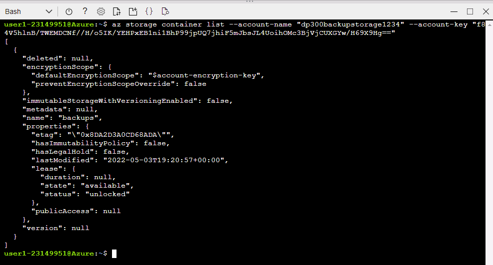
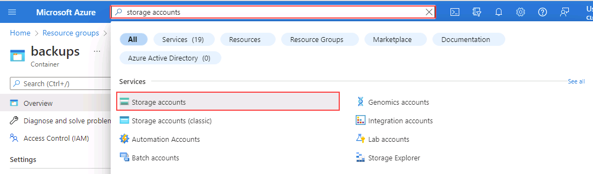

---
lab:
  title: ラボ 15 – URL へのバックアップと URL からの復元
  module: Plan and implement a high availability and disaster recovery solution
---

# Backup to URL

**推定所要時間:30 分**

AdventureWorks の DBA は、Azure で URL にデータベースをバックアップし、人為的なエラーが発生した後、それを Azure BLOB ストレージから復元する必要があります。

## データベースを復元する

1. **https://github.com/MicrosoftLearning/dp-300-database-administrator/blob/master/Instructions/Templates/AdventureWorks2017.bak** にあるデータベース バックアップ ファイルをラボ仮想マシンの **C:\LabFiles\HADR** パスにダウンロードします (このフォルダー構造が存在しない場合は、作成します)。

    

1. Windows の [スタート] ボタンを選択し、SSMS と入力します。 一覧から **[Microsoft SQL Server Management Studio 18]** を選択します。  

    

1. SSMS が開くと、 **[サーバーに接続]** ダイアログに既定のインスタンス名が事前に入力されていることがわかります。 **[接続]** を選択します。

    

1. **Databases** フォルダーを選択し、 **[New Query]** を選択します。

    

1. 次の T-SQL をコピーして、新しいクエリ ウィンドウに貼り付けます。 クエリを実行してデータベースを復元します。

    ```sql
    RESTORE DATABASE AdventureWorks2017
    FROM DISK = 'C:\LabFiles\HADR\AdventureWorks2017.bak'
    WITH RECOVERY,
          MOVE 'AdventureWorks2017' 
            TO 'C:\LabFiles\HADR\AdventureWorks2017.mdf',
          MOVE 'AdventureWorks2017_log'
            TO 'C:\LabFiles\HADR\AdventureWorks2017_log.ldf';
    ```

    **注:** データベース バックアップ ファイルの名前とパスは、手順 1 でダウンロードしたものと一致している必要があります。そうでない場合、コマンドは失敗します。

1. 復元が完了すると、成功メッセージが表示されます。

    

## URL へのバックアップを構成する

1. ラボの仮想マシンからブラウザー セッションを開始し、[https://portal.azure.com](https://portal.azure.com/) に移動します。 このラボ仮想マシンの **[リソース]** タブで提供されている Azure の **[ユーザー名]** と **[パスワード]** を使用してポータルに接続します。

    

1. 下に示すアイコンを選択して、**Cloud Shell** プロンプトを開きます。

    

1. Azure Cloud Shell をまだ使用したことがない場合、ポータルの下半分に Cloud Shell についてのメッセージが表示されることがあります。 **[Bash]** を選択します。

    

1. 前に Cloud Shell を使用したことがない場合は、ストレージを構成する必要があります。 **[詳細設定の表示]** を選択します (別のサブスクリプションが割り当てられている場合があります)。

    

1. 下のダイアログに示すように、既存の**リソース グループ**を使用し、**[ストレージ アカウント]** と **[ファイル共有]** に新しい名前を指定します。 **[リソース グループ]** の名前をメモしておきます。 *contoso-rg* で始まる必要があります。 次に、**[ストレージの作成]** を選びます。

    **注:** ストレージ アカウント名は一意で、特殊文字を含まず、すべて小文字である必要があります。 一意の名前を指定してください。

    

1. 完了すると、下のようなプロンプトが表示されます。 Cloud Shell 画面の左上隅に **Bash** が表示されていることを確認します。

    

1. Cloud Shell で次のコマンドを実行して、CLI から新しいストレージ アカウントを作成します。 上でメモした **contoso-rg** から始まるリソース グループの名前を使用します。

    > [!NOTE]
    > リソース グループ名 ( **-g** パラメーター) を変更し、一意のストレージ アカウント名 ( **-n** パラメーター) を指定します。

    ```bash
    az storage account create -n "dp300backupstorage1234" -g "contoso-rglod23149951" --kind StorageV2 -l eastus2
    ```

    

1. 次に、このストレージ アカウントのキーを取得します。これは、以降の手順で使用します。 ストレージ アカウントの一意の名前とリソース グループを使用して、Cloud Shell で次のコードを実行します。

    ```bash
    az storage account keys list -g contoso-rglod23149951 -n dp300backupstorage1234
    ```

    アカウント キーは、上のコマンドの結果に含まれます。 必ず、前のコマンドで使用したものと同じ名前 (**-n** の後) とリソース グループ (**-g** の後) を使用してください。 次に示すような **key1** の戻り値を (二重引用符なしで) コピーします。

    

1. SQL Server 内のデータベースの URL へのバックアップには、ストレージ アカウント内のコンテナーが使用されます。 この手順で、バックアップ ストレージ専用のコンテナーを作成します。 これを行うには、次のコマンドを実行します。

    ```bash
    az storage container create --name "backups" --account-name "dp300backupstorage1234" --account-key "storage_key" --fail-on-exist
    ```

    ここで **dp300backupstorage1234** はストレージ アカウントの作成時に使用された一意のストレージ アカウント名であり、**storage_key** は上で生成されたキーです。 出力は **true** を返します。

    

1. コンテナーのバックアップが適切に作成されたことを確認するには、次を実行します。

    ```bash
    az storage container list --account-name "dp300backupstorage1234" --account-key "storage_key"
    ```

    ここで **dp300backupstorage1234** はストレージ アカウントの作成時に使用された一意のストレージ アカウント名であり、**storage_key** は生成されたキーです。 出力は以下のような内容を返します。

    

1. コンテナー レベルでの Shared Access Signature (SAS) がセキュリティのために必要です。 これは Cloud Shell または PowerShell を使用して行うことができます。 次を実行します。

    ```bash
    az storage container generate-sas -n "backups" --account-name "dp300backupstorage1234" --account-key "storage_key" --permissions "rwdl" --expiry "date_in_the_future" -o tsv
    ```

    ここで **dp300backupstorage1234** はストレージ アカウントの作成時に使用された一意のストレージ アカウント名、**storage_key** は生成されたキー、**date_in_the_future** は現在より後の時間です。 **date_in_the_future** は UTC である必要があります。 たとえば、**2021-12-31T00:00Z** にします。これは、2020 年 12 月 31 日の午前 0 時に期限切れになるということです。

    出力は下のような内容を返します。 共有アクセス署名全体をコピーし、**メモ帳**に貼り付けてください。次のタスクで使用します。

    

## 資格情報の作成

機能が構成されたので、Azure ストレージ アカウントでバックアップ ファイルを BLOB として生成できます。

1. **SQL Server Management Studio (SSMS)** を起動します。

1. SQL Server に接続するように求められます。 **[Windows 認証]** が選択されていることを確認して、 **[接続]** を選択します。

1. **[新しいクエリ]** を選択します。

1. 次の Transact-SQL を使用して、クラウド内のストレージにアクセスするために使用される資格情報を作成します。 適切な値を入力し、 **[実行]** を選択します。

    ```sql
    IF NOT EXISTS  
    (SELECT * 
        FROM sys.credentials  
        WHERE name = 'https://<storage_account_name>.blob.core.windows.net/backups')  
    BEGIN
        CREATE CREDENTIAL [https://<storage_account_name>.blob.core.windows.net/backups]
        WITH IDENTITY = 'SHARED ACCESS SIGNATURE',
        SECRET = '<key_value>'
    END;
    GO  
    ```

    ここで、 **<storage_account_name>** の両方の出現箇所は作成された一意のストレージ アカウント名であり、 **<key_value>** は前のタスクの最後に次の形式で生成された値です。

    `'se=2020-12-31T00%3A00Z&sp=rwdl&sv=2018-11-09&sr=csig=rnoGlveGql7ILhziyKYUPBq5ltGc/pzqOCNX5rrLdRQ%3D'`

1. 資格情報が正常に作成されたかどうかを確認するには、オブジェクト エクスプローラーの **[セキュリティ] -> [資格情報]** に移動します。

    

1. 間違って入力したために資格情報を再作成する必要がある場合は、次のコマンドを使用して削除できます。必ずストレージ アカウントの名前を変更してください。

    ```sql
    -- Only run this command if you need to go back and recreate the credential! 
    DROP CREDENTIAL [https://<storage_account_name>.blob.core.windows.net/backups]  
    ```

## Backup to URL

1. Transact-SQL で次のコマンドを使用して、データベース **AdventureWorks2017** を Azure にバックアップします。

    ```sql
    BACKUP DATABASE AdventureWorks2017   
    TO URL = 'https://<storage_account_name>.blob.core.windows.net/backups/AdventureWorks2017.bak';
    GO 
    ```

    ここで **<storage_account_name>** は、作成された一意のストレージ アカウント名です。 出力は下のような内容を返します。

    

    正しく構成されていなかった場合は、次のようなエラー メッセージが表示されます。

    

    エラーが発生した場合は、資格情報の作成時に何も誤入力しなかったことと、すべてが正常に作成されたことを確認してください。

## Azure CLI を使用してバックアップを検証する

ファイルが実際に Azure にあることを確認するには、Storage Explorer (プレビュー) または Azure Cloud Shell を使用します。

1. ブラウザー セッションを起動し、[https://portal.azure.com](https://portal.azure.com/) に移動します。 このラボ仮想マシンの **[リソース]** タブで提供されている Azure の **[ユーザー名]** と **[パスワード]** を使用してポータルに接続します。

1. Azure Cloud Shell を使用して、次の Azure CLI コマンドを実行します。

    ```bash
    az storage blob list -c "backups" --account-name "dp300backupstorage1234" --account-key "storage_key" --output table
    ```

    前のコマンドで使用したのと同じ一意のストレージ アカウント名 ( **--account-name** の後) とアカウント キー ( **--account-key** の後) を必ず使用してください。

    

    バックアップ ファイルが正常に生成されたことが確認できます。

## Storage Explorer を使用してバックアップを検証する

1. Storage Explorer (プレビュー) を使用するには、Azure portal のホームページから **[ストレージ アカウント]** を選択します。

    

1. バックアップ用に作成した一意のストレージ アカウント名を選択します。

1. 左側のナビゲーションで、 **[ストレージ ブラウザー (プレビュー)]** を選択します。 **[BLOB コンテナー]** を展開します。

    

1. **[backups]** を選択します。

    

1. バックアップ ファイルがコンテナーに保存されていることに注意してください。

    

## URL から復元

このタスクでは、Azure BLOB ストレージからデータベースを復元する方法について説明します。

1. **SQL Server Management Studio (SSMS)** から **[新しいクエリ]** を選択し、次のクエリを貼り付けて実行します。

    ```sql
    USE AdventureWorks2017;
    GO
    SELECT * FROM Person.Address WHERE AddressId = 1;
    GO
    ```

    

1. こちらのコマンドを実行して、その顧客の名前を変更します。

    ```sql
    UPDATE Person.Address
    SET AddressLine1 = 'This is a human error'
    WHERE AddressId = 1;
    GO
    ```

1. **手順 1** を再実行して、アドレスが変更されたことを確認します。 ここで、誰かが WHERE 句を使用せずに、または間違った WHERE 句を使用して、数千または数百万件の行を変更した場合を想定してください。 解決策の 1 つは、利用可能な最新のバックアップからデータベースを復元することです。

    

1. データベースを復元して、顧客名が誤って変更される前の状態に戻すには、次を実行します。

    **注:** **SET SINGLE_USER WITH ROLLBACK IMMEDIATE** 構文を使用すると、未処理のトランザクションはすべてロールバックされます。 これにより、アクティブな接続が原因で復元が失敗するのを防ぐことができます。

    ```sql
    USE [master]
    GO

    ALTER DATABASE AdventureWorks2017 SET SINGLE_USER WITH ROLLBACK IMMEDIATE
    GO

    RESTORE DATABASE AdventureWorks2017 
    FROM URL = 'https://<storage_account_name>.blob.core.windows.net/backups/AdventureWorks2017.bak'
    GO

    ALTER DATABASE AdventureWorks2017 SET MULTI_USER
    GO
    ```

    ここで **<storage_account_name>** は、作成した一意のストレージ アカウント名です。

    出力は次のようになります。

    

1. **手順 1** を再実行して、顧客名が復元されたことを確認します。

    

Azure Blob Storage サービスへのバックアップまたはそこからの復元を実行するには、コンポーネントおよび対話式操作を理解しておくことが重要です。

これで、Azure で URL にデータベースをバックアップし、必要に応じて復元できることがわかりました。
