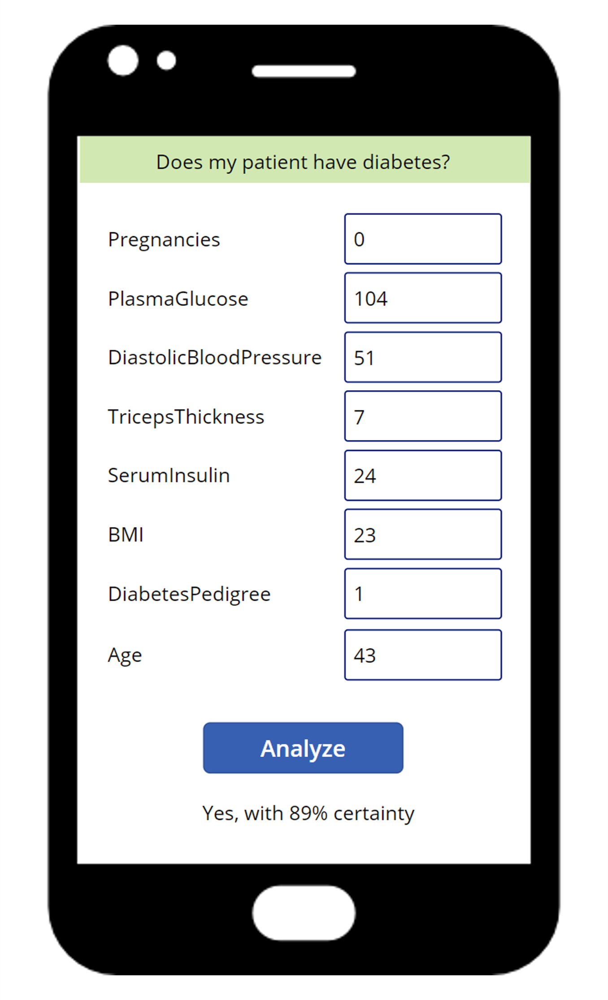
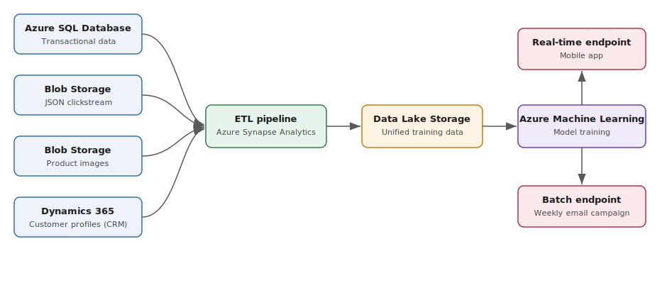

---
lab:
  title: ラボ 17 – 機械学習ソリューションのケース スタディをデザインする
  module: Design a machine learning training solution
  description: Contoso Retail のケース スタディを通じて、商品レコメンデーション システムの機械学習トレーニング ソリューションをデザインし、データ戦略、サービスの選択、コンピューティング リソース、デプロイに関する決定を行います。 最終的には、コスト、パフォーマンス、複雑さ、チーム スキルのバランスを取る、情報に基づいた機械学習デザインの選択を行う方法を理解できるようになります。
  duration: 15
  level: 300
  islab: 'no'
  status: in-development
  targetDate: '2099-01-01'
---

# 機械学習ソリューションをデザインする - ケース スタディ

**推定所要時間: 15 分**

> [!NOTE]
> この演習を完了するには、ケース スタディをよくお読みください。 今までに学んだデザインの原則を活かして、情報に基づいた決定を下します。 最後に、知識チェックの質問に答えて理解度をテストします。

Contoso Retail へようこそ あなたは、機械学習トレーニング ソリューションのデザインを支援する**リード データ サイエンティスト**として採用されました。

## 学習の目的

この演習を終了すると、次のことができるようになります。

- 多様なデータ ソースを統合するためのデータ インジェスト戦略を選択する。
- チームのスキルと規模に基づいて、機械学習のワークロードに最適な Azure サービスを選択する。
- モデル トレーニングのためのコストに応じたコンピューティングをプロビジョニングする。
- リアルタイムとバッチ予測の両方のニーズに応えるデプロイ アプローチをデザインする。

## 問題を理解する

Contoso Retail は、実店舗と eコマースプラットフォームの両方を運営しています。 私たちは、顧客の閲覧履歴や購入履歴に基づいて商品を提案する **商品レコメンデーション システム**を構築したいと考えています。

私たちの目標は、パーソナライズされた商品レコメンデーションを表示して顧客エンゲージメントと売上を増やすことです。

- 当社の**モバイル アプリ**で、顧客が商品を見た瞬間に即座におすすめが表示される必要があります。
- **毎週のメール キャンペーン**では、**200 万人の顧客** 1 人ずつにおすすめする商品の上位 5 品を掲載したいと考えています。

当社のデータ エンジニアリング チームは、過去 **2 年間**顧客とのやり取りデータを収集してきました。これには次の内容が含まれます:

- 閲覧履歴 (閲覧した商品、閲覧していた時間)
- 購入履歴 (購入した商品、購入日、金額)
- 顧客の人口統計 (年齢、所在地、嗜好)
- 商品カタログ (カテゴリ、価格、説明、画像)

データは現在、複数のシステムに保存されています。

| データ ソース | Service | データ型 | フォーマット | 更新の頻度 |
| --- | --- | --- | --- | --- |
| トランザクション データ | Azure SQL データベース | 構造化 | リレーショナル テーブル | リアル タイム |
| クリックストリーム データ | Azure Blob Storage | 半構造化 | JSON ファイル | 1 時間ごと |
| 製品画像 | Azure Blob Storage | 非構造化 | イメージ ファイル | カタログ登録時 |
| 顧客プロファイル | Dynamics 365 (CRM) | 構造化 | CRM レコード | 進行中 |

このレコメンデーション システムを構築するための **機械学習トレーニング ソリューションのデザイン方法**の決定について協力してください。

## 要件を検討する

ソリューションをデザインする際は、これらの重要なポイントを考慮します。

### データの取り込みと準備

- **データ ソースを考慮する**: Azure SQL Database、Blob Storage (JSON ファイル)、Blob Storage (画像)、Dynamics 365 にデータがあります。 このデータをどのように統合すればよいでしょうか?
- **データフォーマットを考慮する**: データの形式はさまざまです (構造化、半構造化、非構造化)。 トレーニングにはどの形式を使用するべきですか?
- **データパイプラインを考慮する**: データ インジェスト パイプラインを構築する必要がありますか? その場合、実行する頻度はどのくらいですか?

### 機械学習のタスクとサービス

- **機械学習のタスクを考慮する**: これはどのような機械学習タスクですか? 分類、回帰、レコメンデーション、あるいはそれ以外ですか?
- **サービスを考慮する**: Azure Machine Learning、Azure Databricks、Microsoft Fabric、Microsoft Foundry のいずれかを使う必要がありますか? この選択に影響を与える要因は何ですか?
- **既存のスキルを考慮する**: 私たちのチームは Python の経験は豊富ですが、Spark の知識は限られています。 これは選択にどのように影響しますか?

### コンピューティング リソース

- **データサイズを考慮する**: 私たちには 200 万人の顧客と数百万件の商品のやり取りがあります。 どのタイプのコンピューティングが適切でしょうか?
- **モデルの複雑性を考慮する**: レコメンデーション システムはシンプル (コラボレーション フィルタリング) にも、複雑 (ディープラーニング) にもなります。 これはコンピューティングのニーズにどのように影響しますか?
- **コストを考慮する**: この初期段階の予算は限られています。 開始するのは CPU と GPU のどちらにすべきでしょうか? 汎用とメモリ最適化のどちらにすべきでしょうか?

### デプロイ要件

- **デプロイの種類を考慮する**: リアルタイムのレコメンデーション (モバイル アプリ) と、バッチ予測 (メール キャンペーン) の両方が必要です。 これらの異なるニーズをどのように処理すればよいでしょうか?
- **頻度を考慮する**: モバイル アプリのレコメンデーションは即時である必要があります。 メール キャンペーンは毎週送信されます。 異なるエンドポイントを使うべきでしょうか?
- **規模を考慮する**: 当社のアプリの 1 日あたりのアクティブ ユーザーは 10 万人です。 当社のメール キャンペーンは 200 万人の顧客をターゲットにしています。 規模はデプロイの決定にどのように影響しますか?

## タスク

これらの要件に基づいて、次に示すデザイン上の決定を下す必要があります:

1. **データ戦略**: トレーニング用のデータをどのようにデータを取り込み、変換し、保存しますか?
2. **サービスの選択**: どの Azure サービスをトレーニングに使用しますか? それはなぜですか?
3. **コンピューティング戦略**: トレーニングのためにどのようなコンピューティング リソースをプロビジョニングしますか?
4. **デプロイ アプローチ**: リアルタイムとバッチ予測の両方の要件にどのように対応しますか?

コスト、パフォーマンス、複雑さ、チームの機能のトレードオフを考慮して、各決定を慎重に検討します。 知識チェックの質問は、このシナリオに基づいて、情報に基づいたデザインの選択を行う能力をテストします。

> [!TIP]
> ソリューション デザインで "正しい" 答えは 1 つであることはほとんどありません。 コスト、パフォーマンス、複雑さ、チームのスキルとのトレードオフに焦点を当てて、選択について十分な根拠を示せるようにしましょう。

## 決定事項を比較する

次のダイアグラムは、すべての要件を満たす 1 つのソリューション アーキテクチャを示しています。 最初にご自分のデザインをスケッチしてから、参照ソリューションを展開して比較します。

参照ソリューションを表示する

- **データ戦略**: ETL パイプライン (Azure Synapse Analytics や Azure Data Factory など) を使用して、Azure SQL Database、Blob Storage、Dynamics 365 からスケジュールに従ってデータを抽出し、Parquet などのトレーニング対応の形式で統合された Azure Data Lake Storage レイヤーに変換して配置します。
- **サービスの選択**: Azure Machine Learning を使用します。 チームのスキルと一致する Python SDK をサポートし、大規模なデータセットにスケーリングし、Spark の専門知識を必要とすることなく、カスタム モデル トレーニング用のエンドツーエンドのツールを提供します。
- **コンピューティング戦略**: 初期段階ではコスト管理のために CPU 汎用コンピューティングから始めます。 トレーニング時間を監視し、モデルの複雑さまたはデータ量に必要な場合にのみ、メモリ最適化または GPU コンピューティングにスケーリングします。
- **デプロイ アプローチ**: トレーニング済みモデルから次の 2 つのエンドポイントを展開します。モバイル アプリのインスタント レコメンデーションのためのリアルタイム (オンライン) エンドポイントと、毎週のメール キャンペーンで 200 万人の顧客すべてを効率的にスコア付けするためのバッチ エンドポイントです。

## 実践に移す

Contoso Retail のケース スタディに基づいて、次の質問に回答してください。 各質問の回答を選択し、**[回答を表示]** を展開して、理由を確認します。

**1. Contoso Retail のケース スタディに基づくと、Azure SQL Database、Blob Storage (JSON)、Dynamics 365 からのデータの統合に最適なデータ インジェスト戦略は何ですか?**

- **回答。** 各ソースから手動でデータをエクスポートし、トレーニング前に Excel でまとめる。
- **B**. Azure Synapse Analytics を使って ETL パイプラインを作成し、データを抽出および変換し、Azure Data Lake Storage のような統一ストレージ レイヤーに読み込む。
- **C**. データを別々のソースに分けて管理し、モデル トレーニング中にそれぞれに直接接続する。

回答を表示

✅ **正解: B。** Azure Synapse Analytics を使って ETL パイプラインを作成し、データを抽出および変換し、Azure Data Lake Storage のような統一ストレージ レイヤーに読み込む。

データは構造化、半構造化、非構造化のソースに分散し、異なるスケジュールで更新されています。 自動化された ETL パイプラインにより、これらのソースが 1 つのトレーニング対応レイヤーに統合されます。 手動エクスポートは何百万回ものやり取りにスケーリングされず、トレーニング中に各ソースに直接接続すると遅延と複雑さが増します。

**2. Contoso Retail のレコメンデーション システムについて、チームの Python の経験と大規模な顧客とのやり取りに関するデータでのトレーニングの必要性を踏まえると、どの Azure サービスが最適でしょうか?**

- **回答。** Microsoft Foundry。事前構築済みのレコメンデーション モデルを提供するため。
- **B**. Azure Machine Learning。Python SDK をサポートし、大規模なデータセットを処理し、カスタム モデル トレーニング用の包括的なツールを提供するため。
- **C**. Azure Databricks。大規模な機械学習に必須であるため。

回答を表示

✅ **正解: B。** Azure Machine Learning。Python SDK をサポートし、大規模なデータセットを処理し、カスタム モデル トレーニング用の包括的なツールを提供するため。

このチームには優れた Python のスキルがありますが、Spark の知識は限られているため、Azure Databricks よりも Azure Machine Learning が適しています。 Azure Databricks は Spark ベースで、すべての大規模な機械学習に必須ではありません。 Microsoft Foundry はカスタム レコメンデーション トレーニングよりも生成 AI に重点を置いています。

**3. Contoso Retail には、リアルタイムのレコメンデーション (モバイル アプリ) とバッチ予測 (毎週のメール キャンペーン) の両方が必要であることを考えると、どのようなデプロイ戦略を実装する必要がありますか?**

- **回答。** モバイル アプリ用のリアルタイム エンドポイントとメール キャンペーン用のバッチ エンドポイントの 2 つの別々のモデルを展開する。
- **B**. メール キャンペーン用にリアルタイム エンドポイントのみを展開し、200 万回呼び出しを行う。
- **C**. バッチ エンドポイントのみを展開し、モバイル アプリでのレコメンデーションには 5 から 10 分の遅延を許容する。

回答を表示

✅ **正解: A。** モバイル アプリ用のリアルタイム エンドポイントとメール キャンペーン用のバッチ エンドポイントの 2 つの別々のモデルを展開する。

この 2 つのシナリオは、遅延やスループットのニーズが異なります。 リアルタイム (オンライン) エンドポイントは、モバイル アプリで即座にレコメンデーションを提供し、バッチ エンドポイントは毎週のメールで 200 万人の顧客を効率的にスコア付けします。 1 つのエンドポイント タイプに両方を強制すると、過剰なコストまたは許容できない遅延が生じます。

**4. 200 万の顧客データセットと予算の制約がある場合、初期の Contoso Retail レコメンデーション モデルのトレーニングに最適なコンピューティング リソースは何ですか?**

- **回答。** CPU 汎用コンピューティングから開始し、パフォーマンスを監視し、必要に応じてメモリ最適化または GPU にスケーリングする。
- **B**. すぐに最大の GPU メモリ最適化コンピューティングをプロビジョニングし、迅速なトレーニングを実現する。
- **C**. Azure のコストを最小限に抑えるために、ローカル開発マシンのみを使用する。

回答を表示

✅ **正解: A。** CPU 汎用コンピューティングから開始し、パフォーマンスを監視し、必要に応じてメモリ最適化または GPU にスケーリングする。

初期予算が限られている場合は、コスト効率の高い CPU 汎用コンピューティングから開始し、モデルの複雑さまたはトレーニング時間が妥当な場合にのみスケールアップします。 最大の GPU 前払いをプロビジョニングすると予算が無駄になり、ローカル コンピューターでは 200 万人の顧客と数百万のやり取りの規模を処理できません。

## 要点

- **トレーニング前にデータをまとめる。** 多様なソースと形式は、自動化されたパイプラインを通じて、トレーニングに対応した単一のストレージ レイヤーに流れる必要があります。
- **サービスをチームや規模に合わせて調整する。** 最も強力な選択肢ではなく、チームの既存のスキルとデータ量に合ったプラットフォームを選択します。
- **小規模なコンピューティングから開始し、スケールアップする。** コスト効率の高いコンピューティングから始め、ワークロードが必要とする場合にのみ、メモリ最適化または GPU リソースを追加します。
- **予測の活用方法を踏まえてデプロイをデザインする。** 即時応答にはリアルタイム エンドポイントを使用し、大量のスケジュールされたスコアリングにはバッチ エンドポイントを使用します。
